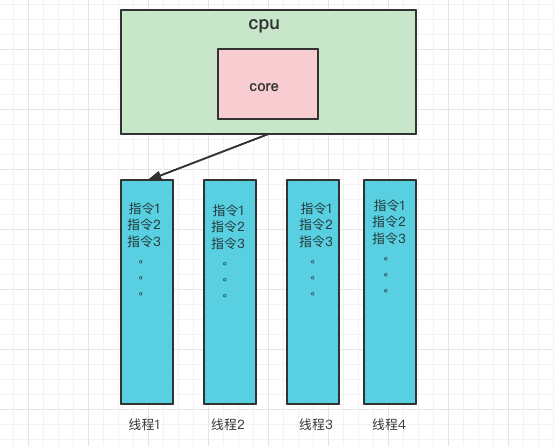
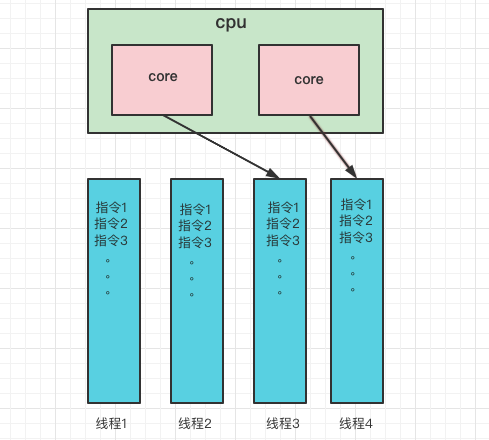

## 一、进程&线程

### 1、进程

 * 进程由`指令`和`数据`组成，但这些指令要运行，数据要读写，就必须将指令加载至CPU，数据加载至内存。
   在指令运行过程中还需要用到磁盘、网络等设备。进程就是用来加载指令、管理内存、管理IO的
 * 当一个程序被运行，从磁盘加载这个程序的代码至内存，这是就开启了一个进程。
 * 进程可以视为`程序的一个实例`。大部分程序可以同时运行多个实例进程(例如：笔记本、画图、浏览器等)，
   也有的程序只能启动一个实例进程（例如：网易云音乐、360安全卫士等）

### 2、线程

 * 一个进程之内可以分为一到多个线程
 * 一个线程就是一个指令流，将指令流中的一条条指令以一定的顺序交给CPU执行
 * java中，线程作为`最小调度单位`，进程作为资源分配的最小单位。在windows中进程是不活动的，只是
   作为线程的容器

### 3、两者对比

 * 进程基本上相互独立的，而线程存在与进程内，是进程的一个子集
 * 进程拥有共享的资源，如内存空间等，供其内部的线程共享
 * 进程间通信较为复杂
     * 同一台计算机的进程通信称为`IPC(Inter-process communication)`
     * 不同计算机之间的进程通信，需要通过网络，并遵守共同的协议，例如HTTP
 * 线程通信相对简单，因为它们共享进程内的内存，一个例子是多个线程可以访问同一个共享变量
 * 线程更轻量，`线程`上下文切换成本一般上要比`进程`上下文切换`低`

## 二、并行&并发

引用Rob Pike的一段描述：
 * 并发(concurrent)是同一时间应对(dealing with)多件事情的能力
 * 并行(parallel)是同一时间动手做(doing)多件事情的能力

### 1、并发

线程轮流使用CPU的做法称为并发(concurrent)

### 2、并行

多核CPU下，每个`核(core)`都可以调度运行线程，这时候线程是可以并行的。

----

> 这里缺少 P7-P10的内容，搭建测试环境比较麻烦，基本都是代码的案例。。。先不写

