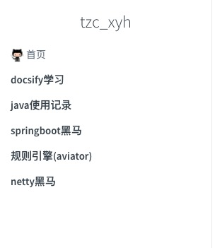

> 因为之前去除掉了 subMaxLevel 配置，导致我的侧边栏目录不会折叠了  
> 今天找了一下让侧边栏折叠的方法：docsify-sidebar-collapse
> github地址：https://github.com/iPeng6/docsify-sidebar-collapse

### 1.引入插件

在index.html中加入插件
```
<script src="//cdn.jsdelivr.net/npm/docsify-sidebar-collapse/dist/docsify-sidebar-collapse.min.js"></script>
```

### 2.这里有一个配置是必须开启的
```javascript
    window.$docsify = {
      loadSidebar: true
    }  
```

### 3.效果


在git中给了两种折叠的效果，个人不太喜欢，所以就没有使用