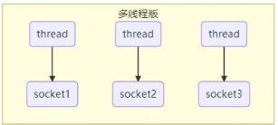
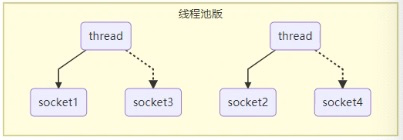
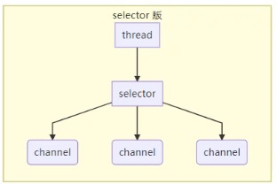

>文章知识来源：   
> https://www.bilibili.com/video/BV1py4y1E7oA
----

## 一.Channel
channel 有一点类似与stream， 是读写数据的 **双向通道** ，可以从channel 将数据读入 buffer，
也可以将buffer的数据写入channel， 而之前的stream 要么是输入，要么是输出， channel 比 stream 更为底层

常见的Channel：   
FileChannel(文件)、DatagramChannel(UDP)、SocketChannel、SocketServerChannel

## 二.Buffer
buffer 用来缓冲读写数据

常见的Buffer：
ByteBuffer(常用，抽象类)：MapperByteBuffer、DirectByteBuffer、HeapByteBuffer    
ShortBuffer、IntBuffer、LongBuffer、FloatBuffer、DoubleBuffer、CharBuffer

## 三.Selector
selector的作用是配合一个线程来管理多个channel， 获取这些channel上发生的事件，
这些channel工作在非阻塞模式下，不会让线程吊死在一个channel上。适合连接数特别多，
但流量低的场景(low traffic)

使用结合服务器的设计演化来理解它的用途

### 1.多线程版设计
每一个socket连接，创建一个线程    

缺点：    
内存占用高、线程上下文切换成本高、只适合连接数少的场景

### 2.线程池版设计
创建线程池，处理socket请求，减少线程数。如果是socket长连接的话，会一直占用着线程

缺点：    
阻塞模式下，线程仅能处理一个socket连接、仅适合短连接场景

### 3.Selector版设计
调用selector的select()会阻塞直到channel发生了读写就绪事件，这些事件发生，
select方法就会返回这些事件交给thread来处理

