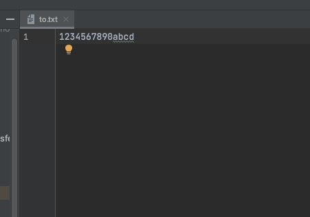

> 在 FileChannel 中有 transferTo/transferFrom 两个方法
> 都可以将一个文件中的内容传输到另外一个文件中

### 1. 代码演示
```java
import java.io.FileInputStream;
import java.io.FileOutputStream;
import java.io.IOException;
import java.nio.channels.FileChannel;

public class TestFileChannelTransferTo {

    public static void main(String[] args) {
        try (
                FileChannel form = new FileInputStream("data.txt").getChannel();
                FileChannel to = new FileOutputStream("to.txt").getChannel()
        ) {
            //起始位置     写入多少个字节    写入到哪里
            form.transferTo(0, form.size(),to);
        } catch (IOException e) {
            e.printStackTrace();
        }
    }
}
```

### 2.效果


### 3.传输数据大于 2G
transferTo 一次只能传输 2G 数据。如果源文件的大小超过，会导致写入的文件的大小只有2G  
修改一下上面的代码
```java
import java.io.FileInputStream;
import java.io.FileOutputStream;
import java.io.IOException;
import java.nio.channels.FileChannel;

public class TestFileChannelTransferTo {

    public static void main(String[] args) {
        try (
                FileChannel form = new FileInputStream("data.txt").getChannel();
                FileChannel to = new FileOutputStream("to.txt").getChannel()
        ) {
            //获取到源文件大小
            long size = form.size();
            //分段传
            for (long left = size; left > 0;) {
                System.out.println("position:" + (size - left) + "   left:" + left);
                //一次传10个字节看看效果
                // 10原为 left： 为了看效果，才设置为 10
                left -= form.transferTo(size - left, 10, to);
            }
        } catch (IOException e) {
            e.printStackTrace();
        }
    }
}
```

控制台输出
```
position:0   left:14
position:10   left:4
```

