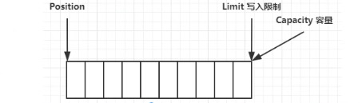
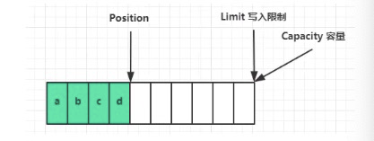
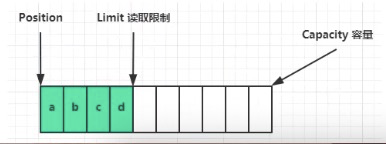
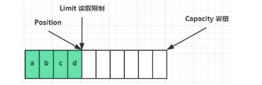
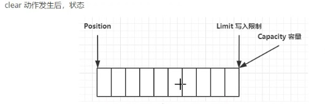
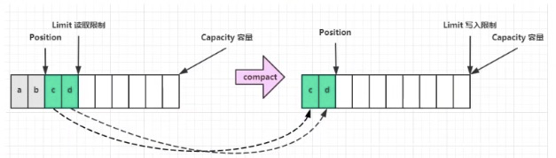

## 一.使用FileChannel读取文件

> 使用姿势   
> 1.向buffer写入数据，例如调用channel.read(buffer)   
> 2.调用flip()切换至读模式   
> 3.从 buffer 读取数据， 例如调用 buffer.get()  
> 4.调用 clear() 或 compact() 切换至写模式  
> 5.重复1～4步骤

```java
@Slf4j
public class TestByteBuffer {

    public static void main(String[] args) {
        //获取 FileChannel
        //获取方法： 1.输入输出流  2.RandomAccessFile
        try (FileChannel channel = new FileInputStream("data.txt").getChannel()) {
            //准备缓冲区  缓冲区大小为10
            ByteBuffer buffer = ByteBuffer.allocate(10);

            while (true){
                //从  channel 读取数据，向 buffer 写入
                int len = channel.read(buffer);
                log.info("读取到的数据长度为：{}",len);
                if(len == -1){
                    break;
                }
                //打印buffer数据
                buffer.flip();//切换至读模式
                while (buffer.hasRemaining()){//是否还有剩余未读取数据
                    byte b = buffer.get();
                    log.info("读取到的数据为：{}",(char) b);
                }
                buffer.clear();//切换成写模式
            }
        } catch (IOException e) {
        }
    }
}
```

## 二.ByteBuffer结构
ByteBuffer重要属性：   
capacity(容量)、position(当前节点，写入位置/读取位置)、limit(限制位置，写入限制/读取限制)

一开始：position(写入位置)在起始节点，limit(写入限制)等于容量



写模式：position(写入位置),向后移动，不断读入字节



flip后：切换到读模式。position(读取位置)指向回到起始， limit(读取限制)指向读取到的最后一个字节位置



读取字节后：position(读取位置)向后移动，直到limit位置



clear后： 回到一开始的状态



compact后： 把没有读取完的数据向前压



## 三.代码演示
对上面每一步进行一个代码演示，通过 ByteBufferUtil.java 工具类，观察效果

```java
package me.xyh.netty.c1;

import me.xyh.netty.util.ByteBufferUtil;

import java.nio.ByteBuffer;

public class TestByteBufferReadWrite {

    public static void main(String[] args) {
        //一开始
        ByteBuffer buffer = ByteBuffer.allocate(10);
        ByteBufferUtil.debugAll(buffer);

        //写入一个字节 a
        buffer.put((byte) 0x61);
        ByteBufferUtil.debugAll(buffer);

        //写入字节数组
        buffer.put(new byte[]{0x62, 0x63, 0x64});
        ByteBufferUtil.debugAll(buffer);

        //切换到读模式
        buffer.flip();
        ByteBufferUtil.debugAll(buffer);

        //读取一个字节
        buffer.get();
        ByteBufferUtil.debugAll(buffer);

        //下面的代码可以分别放开，观察效果
        //两个方法的调用，都可以让 buffer 会到写模式
        //调用clear()
        //buffer.clear();
        //ByteBufferUtil.debugAll(buffer);

        //调用compact()
        //buffer.compact();
        //ByteBufferUtil.debugAll(buffer);
    }
}

```

> 控制台输出如下   

一开始，position = 0， limit = 10;
```
+--------+-------------------- all ------------------------+----------------+
position: [0], limit: [10]
         +-------------------------------------------------+
         |  0  1  2  3  4  5  6  7  8  9  a  b  c  d  e  f |
+--------+-------------------------------------------------+----------------+
|00000000| 00 00 00 00 00 00 00 00 00 00                   |..........      |
+--------+-------------------------------------------------+----------------+
```
写入一个字节后, position 向后移动
```
+--------+-------------------- all ------------------------+----------------+
position: [1], limit: [10]
         +-------------------------------------------------+
         |  0  1  2  3  4  5  6  7  8  9  a  b  c  d  e  f |
+--------+-------------------------------------------------+----------------+
|00000000| 61 00 00 00 00 00 00 00 00 00                   |a.........      |
+--------+-------------------------------------------------+----------------+
```
再写入一个字符数组 bcd ，position 向后一个三位
```
+--------+-------------------- all ------------------------+----------------+
position: [4], limit: [10]
         +-------------------------------------------------+
         |  0  1  2  3  4  5  6  7  8  9  a  b  c  d  e  f |
+--------+-------------------------------------------------+----------------+
|00000000| 61 62 63 64 00 00 00 00 00 00                   |abcd......      |
+--------+-------------------------------------------------+----------------+
```
调用 flip(), 切换成读模式， position = 0 ，limit = 4
```
+--------+-------------------- all ------------------------+----------------+
position: [0], limit: [4]
         +-------------------------------------------------+
         |  0  1  2  3  4  5  6  7  8  9  a  b  c  d  e  f |
+--------+-------------------------------------------------+----------------+
|00000000| 61 62 63 64 00 00 00 00 00 00                   |abcd......      |
+--------+-------------------------------------------------+----------------+
```
读取一个字符 ， position 先后移动一位
```
+--------+-------------------- all ------------------------+----------------+
position: [1], limit: [4]
         +-------------------------------------------------+
         |  0  1  2  3  4  5  6  7  8  9  a  b  c  d  e  f |
+--------+-------------------------------------------------+----------------+
|00000000| 61 62 63 64 00 00 00 00 00 00                   |abcd......      |
+--------+-------------------------------------------------+----------------+
```
如果调用clear(), 会直接把 position重置为 0
```
+--------+-------------------- all ------------------------+----------------+
position: [0], limit: [10]
         +-------------------------------------------------+
         |  0  1  2  3  4  5  6  7  8  9  a  b  c  d  e  f |
+--------+-------------------------------------------------+----------------+
|00000000| 61 62 63 64 00 00 00 00 00 00                   |abcd......      |
+--------+-------------------------------------------------+----------------+
```
如果调用compact(),因为上面读取了一个字节，所以 将bcd 向前移动， position = 3
```
+--------+-------------------- all ------------------------+----------------+
position: [3], limit: [10]
         +-------------------------------------------------+
         |  0  1  2  3  4  5  6  7  8  9  a  b  c  d  e  f |
+--------+-------------------------------------------------+----------------+
|00000000| 62 63 64 64 00 00 00 00 00 00                   |bcdd......      |
+--------+-------------------------------------------------+----------------+
```
