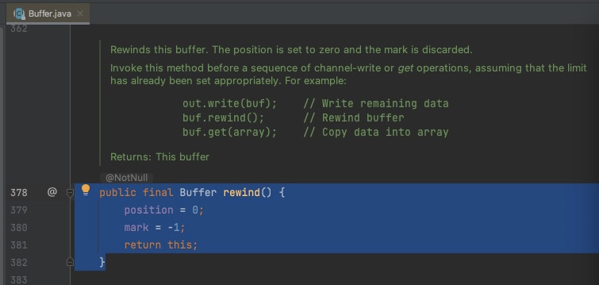

## 一.分配空间
有两种方式：allocate/allocateDirect

### 1.allocate
创建的是 HeapByteBuffer（）
java堆内存，读写效率较低，受到GC的影响
```java
ByteBuffer buffer = ByteBuffer.allocate(16);
System.out.println(buffer.getClass());
// java.nio.HeapByteBuffer
```

### 2.allocateDirect
创建的是 DirectByteBuffer
直接内存，读写效率高(少一次拷贝)，不受GC的影响，分配效率低
```java
 ByteBuffer buffer = ByteBuffer.allocateDirect(16);
 System.out.println(buffer.getClass());
 /java.nio.DirectByteBuffer
```

## 二.向 buffer 写入数据

### 1.调用channel的 read 方法
```java
int readBytes = channel.read(buf);
```

### 2.调用buffer 自己的 put 方法
```java
buf.put((byte)127);
```

## 三.从 buffer 读取数据

### 1.调用channel的 write 方法
```java
int writeBytes = channel.write(buf);
```

### 2.调用buffer 自己的get 方法
```java
byte b = buf.get();
```
get方法会让 position 读指针向后走，如果向重置读取数据  
可以调用rewind 方法将position重新设置为0   
调用get(int i) 方法获取所以 i 的内容，不会移动读指针

### 3.rewind
源码：把position 设置为0


使用演示：
```java
import me.xyh.netty.util.ByteBufferUtil;
import java.nio.ByteBuffer;

public class TestByteBufferReWind {

    public static void main(String[] args) {
        ByteBuffer buffer = ByteBuffer.allocate(10);
        buffer.put(new byte[]{'a', 'b', 'c', 'd'});
        buffer.flip();
        //读取4个字节
        buffer.get(new byte[4]);
        ByteBufferUtil.debugAll(buffer);
        //重置
        buffer.rewind();
        ByteBufferUtil.debugAll(buffer);

    }
}
```
控制台输出
```
读取4个字节后
+--------+-------------------- all ------------------------+----------------+
position: [4], limit: [4]
         +-------------------------------------------------+
         |  0  1  2  3  4  5  6  7  8  9  a  b  c  d  e  f |
+--------+-------------------------------------------------+----------------+
|00000000| 61 62 63 64 00 00 00 00 00 00                   |abcd......      |
+--------+-------------------------------------------------+----------------+


调用 rewind 后
+--------+-------------------- all ------------------------+----------------+
position: [0], limit: [4]
         +-------------------------------------------------+
         |  0  1  2  3  4  5  6  7  8  9  a  b  c  d  e  f |
+--------+-------------------------------------------------+----------------+
|00000000| 61 62 63 64 00 00 00 00 00 00                   |abcd......      |
+--------+-------------------------------------------------+----------------+
```

### 4.mark & reset
mark: 标记一个 position 的位置  
reset： 让 position 回到 mark标记 的位置  
使用演示：
```java
import me.xyh.netty.util.ByteBufferUtil;
import java.nio.ByteBuffer;

public class TestByteBufferMarkReset {

    public static void main(String[] args) {
        ByteBuffer buffer = ByteBuffer.allocate(10);
        buffer.put(new byte[]{'a', 'b', 'c', 'd'});
        buffer.flip();
        //读取4个字节
        System.out.println("读取到：" + (char) buffer.get());
        System.out.println("读取到：" + (char) buffer.get());
        buffer.mark();
        System.out.println("读取到：" + (char) buffer.get());
        System.out.println("读取到：" + (char) buffer.get());
        buffer.reset();
        ByteBufferUtil.debugAll(buffer);
    }
}
```
控制台输出
```
读取到：a
读取到：b
读取到：c
读取到：d

调用reset 后 position 回到了 2 

+--------+-------------------- all ------------------------+----------------+
position: [2], limit: [4]
         +-------------------------------------------------+
         |  0  1  2  3  4  5  6  7  8  9  a  b  c  d  e  f |
+--------+-------------------------------------------------+----------------+
|00000000| 61 62 63 64 00 00 00 00 00 00                   |abcd......      |
+--------+-------------------------------------------------+----------------+
```

### 5.get(i)
get(i) 按索引获取数据 ， 不会改变 position 的指向

使用演示：
```java
import me.xyh.netty.util.ByteBufferUtil;
import java.nio.ByteBuffer;

public class TestByteBufferGeti {

    public static void main(String[] args) {
        ByteBuffer buffer = ByteBuffer.allocate(10);
        buffer.put(new byte[]{'a', 'b', 'c', 'd'});
        buffer.flip();
        
        System.out.println("读取到：" + (char) buffer.get(3));
        ByteBufferUtil.debugAll(buffer);
    }
}

```
控制台输出
```
读取到：d

读取了一个字符，position的位置没有发生变化

+--------+-------------------- all ------------------------+----------------+
position: [0], limit: [4]
         +-------------------------------------------------+
         |  0  1  2  3  4  5  6  7  8  9  a  b  c  d  e  f |
+--------+-------------------------------------------------+----------------+
|00000000| 61 62 63 64 00 00 00 00 00 00                   |abcd......      |
+--------+-------------------------------------------------+----------------+
```

## 四.字符串转ByteBuffer

### 1.put
转换后，buffer还是保持在写模式
```java
import me.xyh.netty.util.ByteBufferUtil;
import java.nio.ByteBuffer;

public class TestByteBufferString {

    public static void main(String[] args) {
        // 字符串 转 ByteBuffer
        ByteBuffer buffer = ByteBuffer.allocate(16);
        buffer.put("hello".getBytes());
        ByteBufferUtil.debugAll(buffer);
    }
}
```
控制台输出
```
+--------+-------------------- all ------------------------+----------------+
position: [5], limit: [16]
         +-------------------------------------------------+
         |  0  1  2  3  4  5  6  7  8  9  a  b  c  d  e  f |
+--------+-------------------------------------------------+----------------+
|00000000| 68 65 6c 6c 6f 00 00 00 00 00 00 00 00 00 00 00 |hello...........|
+--------+-------------------------------------------------+----------------+
```

### 2.Charset
转换后，buffer自动切换到了读模式
```java
import me.xyh.netty.util.ByteBufferUtil;
import java.nio.ByteBuffer;

public class TestByteBufferString {

    public static void main(String[] args) {
        //2. Charset
        ByteBuffer buffer = StandardCharsets.UTF_8.encode("hello");
        ByteBufferUtil.debugAll(buffer);
    }
}
```
控制台输出
```
+--------+-------------------- all ------------------------+----------------+
position: [0], limit: [5]
         +-------------------------------------------------+
         |  0  1  2  3  4  5  6  7  8  9  a  b  c  d  e  f |
+--------+-------------------------------------------------+----------------+
|00000000| 68 65 6c 6c 6f                                  |hello           |
+--------+-------------------------------------------------+----------------+
```


### 3.wrap
转换后，buffer自动切换到了读模式
```java
import me.xyh.netty.util.ByteBufferUtil;
import java.nio.ByteBuffer;

public class TestByteBufferString {

    public static void main(String[] args) {
        //wrap
        ByteBuffer buffer = ByteBuffer.wrap("hello".getBytes());
        ByteBufferUtil.debugAll(buffer);
    }
}
```
控制台输出
```
+--------+-------------------- all ------------------------+----------------+
position: [0], limit: [5]
         +-------------------------------------------------+
         |  0  1  2  3  4  5  6  7  8  9  a  b  c  d  e  f |
+--------+-------------------------------------------------+----------------+
|00000000| 68 65 6c 6c 6f                                  |hello           |
+--------+-------------------------------------------------+----------------+
```

## 五.ByteBuffer转字符串
直接使用 Charset 的 decode
需要buffer是 **读模式**
```
StandardCharsets.UTF_8.decode(buffer).toString()
```