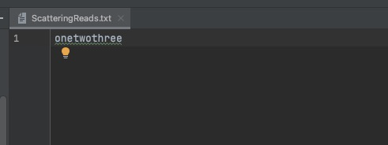
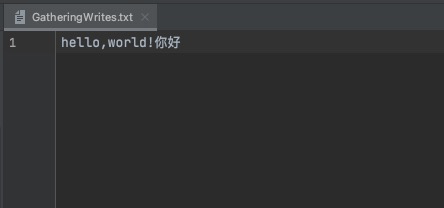

## 一.ScatteringReads(分散读)

### 1.新建需要读取的文件
新建 ScatteringReads.txt , 内容为 onetwothree


### 2.代码演示

```java
import me.xyh.netty.util.ByteBufferUtil;

import java.io.IOException;
import java.io.RandomAccessFile;
import java.nio.ByteBuffer;
import java.nio.channels.FileChannel;

/**
 * 分散读
 */
public class TestScatteringReads {

    public static void main(String[] args) {
        ByteBuffer b1 = ByteBuffer.allocate(3);
        ByteBuffer b2 = ByteBuffer.allocate(3);
        ByteBuffer b3 = ByteBuffer.allocate(5);
        //从 ScatteringReads.txt 读取数据，只设置一个读模式就可以
        try (FileChannel channel = new RandomAccessFile("ScatteringReads.txt", "r").getChannel()) {
            //分散读取到3个ByteBuffer中
            channel.read(new ByteBuffer[]{b1, b2, b3});
            //切换到读模式
            b1.flip();
            b2.flip();
            b3.flip();
            ByteBufferUtil.debugAll(b1);
            ByteBufferUtil.debugAll(b2);
            ByteBufferUtil.debugAll(b3);
        } catch (IOException e) {
        }
    }
}
```

### 3.控制台输出

```
+--------+-------------------- all ------------------------+----------------+
position: [0], limit: [3]
         +-------------------------------------------------+
         |  0  1  2  3  4  5  6  7  8  9  a  b  c  d  e  f |
+--------+-------------------------------------------------+----------------+
|00000000| 6f 6e 65                                        |one             |
+--------+-------------------------------------------------+----------------+

+--------+-------------------- all ------------------------+----------------+
position: [0], limit: [3]
         +-------------------------------------------------+
         |  0  1  2  3  4  5  6  7  8  9  a  b  c  d  e  f |
+--------+-------------------------------------------------+----------------+
|00000000| 74 77 6f                                        |two             |
+--------+-------------------------------------------------+----------------+

+--------+-------------------- all ------------------------+----------------+
position: [0], limit: [5]
         +-------------------------------------------------+
         |  0  1  2  3  4  5  6  7  8  9  a  b  c  d  e  f |
+--------+-------------------------------------------------+----------------+
|00000000| 74 68 72 65 65                                  |three           |
+--------+-------------------------------------------------+----------------+
```

## GatheringWrites(集中写)

### 1.代码演示

```java
import java.io.IOException;
import java.io.RandomAccessFile;
import java.nio.ByteBuffer;
import java.nio.channels.FileChannel;
import java.nio.charset.StandardCharsets;

public class TestGatheringWrites {

    public static void main(String[] args) {
        //写入数据到 GatheringWrites.txt，需要设置 读写 模式
        try (FileChannel channel = new RandomAccessFile("GatheringWrites.txt","rw").getChannel()) {
            ByteBuffer b1 = StandardCharsets.UTF_8.encode("hello,");
            ByteBuffer b2 = StandardCharsets.UTF_8.encode("world!");
            ByteBuffer b3 = StandardCharsets.UTF_8.encode("你好");
            channel.write(new ByteBuffer[]{b1 ,b2 ,b3});
        } catch (IOException e) {
        }
    }
}
```

### 2.输出结果
在项目文件中，多了一个 GatheringWrites.txt ， 内容为 hello,world!你好


