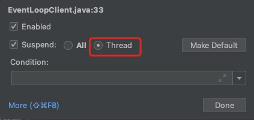

## 一.简介

EventLoop(事件循环对象)本质是一个单线程执行器(同时维护了一个Selector)，里面有run方法处理Channel上源源不断的
io事件。  
继承关系： 
  * `java.util.concurrent.ScheduledExecutorService`,因此包含了线程池中所有的方法
  * `io.netty.util.concurrent.OrderedEventExecutor`
    * 提供了 boolean inEventLoop(Thread thread) 方法判断一个线程是否属于此 EventLoop
    * 提供了 parent 方法来看看自己属于哪个 EventLoopGroup

EventLoopGroup(事件循环组)是一组EventLoop，Channel一般会调用EventLoopGroup的register方法来绑定其中一个
EventLoop，后续这个Channel上的io事件都由此EventLoop来处理(保证了io事件处理时的线程安全)  
继承关系：  
  * `io.netty.util.concurrent.EventExecutorGroup`
    * 实现了 Iterable 接口提供遍历 EventLoop 的能力
    * 另有 next 方法获取集合中下一个 EventLoop

## 二.普通定时任务

### 1.常见的 EventLoopGroup 实现

> NioEventLoopGroup() : io事件、普通任务、定时任务
> DefaultEventLoopGroup() : 普通任务、定时任务

### 2.默认线程数(源码)

```java
    // 获取配置数(需要大于 1 ) 或者 服务器的线程数 * 2
    private static final int DEFAULT_EVENT_LOOP_THREADS = Math.max(1, SystemPropertyUtil.getInt("io.netty.eventLoopThreads", NettyRuntime.availableProcessors() * 2));

    protected MultithreadEventLoopGroup(int nThreads, Executor executor, Object... args) {
        super(nThreads == 0 ? DEFAULT_EVENT_LOOP_THREADS : nThreads, executor, args);
    }
```

### 3.获取下一个事件循环对象

> EventLoopGroup.next() 会循环获取对象

### 3.代码演示

```java
import io.netty.channel.EventLoopGroup;
import io.netty.channel.nio.NioEventLoopGroup;
import lombok.extern.slf4j.Slf4j;

import java.util.concurrent.TimeUnit;

@Slf4j
public class TestEventLoop {
    public static void main(String[] args) {
        //1.创建事件循环组--两个线程
        EventLoopGroup group = new NioEventLoopGroup(2);
        //2.演示获取下一个循环对象
        System.out.println("演示获取下一个循环对象:");
        System.out.println(group.next());
        System.out.println(group.next());
        System.out.println(group.next());
        System.out.println(group.next());

        //普通任务
        group.next().submit(() -> {
            log.info("执行普通任务");
        });
        
        //执行定时任务
        group.next().scheduleAtFixedRate(() -> {
            log.info("执行定时任务....");
        } ,0,1, TimeUnit.SECONDS);
    }
}
```

### 4.控制台输出

```
演示获取下一个循环对象:
io.netty.channel.nio.NioEventLoop@573f2bb1
io.netty.channel.nio.NioEventLoop@5ae9a829
//两个线程循环打印
io.netty.channel.nio.NioEventLoop@573f2bb1
io.netty.channel.nio.NioEventLoop@5ae9a829
20:38:52 [INFO ] [nioEventLoopGroup-2-1] m.x.n.c.TestEventLoop - 执行普通任务
20:38:52 [INFO ] [nioEventLoopGroup-2-2] m.x.n.c.TestEventLoop - 执行定时任务....
20:38:53 [INFO ] [nioEventLoopGroup-2-2] m.x.n.c.TestEventLoop - 执行定时任务....
20:38:54 [INFO ] [nioEventLoopGroup-2-2] m.x.n.c.TestEventLoop - 执行定时任务....
20:38:55 [INFO ] [nioEventLoopGroup-2-2] m.x.n.c.TestEventLoop - 执行定时任务....
```

## 三.IO任务

> 演示`EventLoopGroup`处理IO任务

### 1.EventLoopServer.class
```java
import io.netty.bootstrap.ServerBootstrap;
import io.netty.buffer.ByteBuf;
import io.netty.channel.ChannelHandlerContext;
import io.netty.channel.ChannelInboundHandlerAdapter;
import io.netty.channel.ChannelInitializer;
import io.netty.channel.nio.NioEventLoopGroup;
import io.netty.channel.socket.SocketChannel;
import io.netty.channel.socket.nio.NioServerSocketChannel;
import lombok.extern.slf4j.Slf4j;

import java.net.InetSocketAddress;
import java.nio.charset.Charset;

@Slf4j
public class EventLoopServer {
    public static void main(String[] args) {
        new ServerBootstrap()
                .group(new NioEventLoopGroup())
                .channel(NioServerSocketChannel.class)
                .childHandler(new ChannelInitializer<SocketChannel>() {
                    @Override
                    protected void initChannel(SocketChannel ch) throws Exception {
                        ch.pipeline().addLast(new ChannelInboundHandlerAdapter(){
                            @Override
                            public void channelRead(ChannelHandlerContext ctx, Object msg) throws Exception {
                                //msg 为ButeBuf对象
                                ByteBuf buf = (ByteBuf) msg;
                                log.info(buf.toString(Charset.defaultCharset()));
                            }
                        });
                    }
                })
                .bind(new InetSocketAddress(8080));
    }
}
```

### 2.EventLoopClient.class
```java
import io.netty.bootstrap.Bootstrap;
import io.netty.channel.Channel;
import io.netty.channel.ChannelInitializer;
import io.netty.channel.nio.NioEventLoopGroup;
import io.netty.channel.socket.nio.NioSocketChannel;
import io.netty.handler.codec.string.StringEncoder;

import java.net.InetSocketAddress;

public class EventLoopClient {
    public static void main(String[] args) throws InterruptedException {
        //1.启动器
        Channel channel = new Bootstrap()
                //2.添加 EventLoop
                .group(new NioEventLoopGroup())
                //3.选择客户端 channel 实现
                .channel(NioSocketChannel.class)
                //4.添加处理器
                .handler(new ChannelInitializer<NioSocketChannel>() {
                    @Override//建立连接后被调用
                    protected void initChannel(NioSocketChannel ch) throws Exception {
                        ch.pipeline().addLast(new StringEncoder());
                    }
                })
                //5.连接到服务器
                .connect(new InetSocketAddress("localhost",8080))
                .sync()
                .channel();
        System.out.println(channel);
        //下面一行大断点，用于调试
        System.out.println("");
    }
}
```

### 3.注意

dubug模式启动`EventLoopClient`需要进行如下设置：  




## 四.细化分工

### 1.使用boss/worker方式
由一个`EventLoopGroup`代表boss，主要负责连接  
由另一个`EventLoopGroup`代表worker，主要负责初连接外的其他事件

> .group(boss,worker)重载方法

```java
import io.netty.bootstrap.ServerBootstrap;
import io.netty.buffer.ByteBuf;
import io.netty.channel.ChannelHandlerContext;
import io.netty.channel.ChannelInboundHandlerAdapter;
import io.netty.channel.ChannelInitializer;
import io.netty.channel.nio.NioEventLoopGroup;
import io.netty.channel.socket.SocketChannel;
import io.netty.channel.socket.nio.NioServerSocketChannel;
import lombok.extern.slf4j.Slf4j;

import java.net.InetSocketAddress;
import java.nio.charset.Charset;

@Slf4j
public class EventLoopServer {
    public static void main(String[] args) {
        new ServerBootstrap()
                //参数1：boss 负责连接           参数2：worker负责除连接外的其他事件
                .group(new NioEventLoopGroup(), new NioEventLoopGroup(2))
                .channel(NioServerSocketChannel.class)
                .childHandler(new ChannelInitializer<SocketChannel>() {
                    @Override
                    protected void initChannel(SocketChannel ch) throws Exception {
                        ch.pipeline().addLast(new ChannelInboundHandlerAdapter(){
                            @Override
                            public void channelRead(ChannelHandlerContext ctx, Object msg) throws Exception {
                                //msg 为ButeBuf对象
                                ByteBuf buf = (ByteBuf) msg;
                                log.info(buf.toString(Charset.defaultCharset()));
                            }
                        });
                    }
                })
                .bind(new InetSocketAddress(8080));
    }
}

```

### 2.新建EventLoopGroup处理耗时事件，防止阻塞io

> ch.pipeline().addLast(handlerName, handler)  
> ch.pipeline().addLast(group, handlerName, handler)

```java
import io.netty.bootstrap.ServerBootstrap;
import io.netty.buffer.ByteBuf;
import io.netty.channel.*;
import io.netty.channel.nio.NioEventLoopGroup;
import io.netty.channel.socket.SocketChannel;
import io.netty.channel.socket.nio.NioServerSocketChannel;
import lombok.extern.slf4j.Slf4j;

import java.net.InetSocketAddress;
import java.nio.charset.Charset;

@Slf4j
public class EventLoopServer {
    public static void main(String[] args) {
        EventLoopGroup group = new DefaultEventLoopGroup(2);
        new ServerBootstrap()
                .group(new NioEventLoopGroup(), new NioEventLoopGroup(2))
                .channel(NioServerSocketChannel.class)
                .childHandler(new ChannelInitializer<SocketChannel>() {
                    @Override
                    protected void initChannel(SocketChannel ch) throws Exception {
                        ch.pipeline().addLast("handler1", new ChannelInboundHandlerAdapter(){
                            @Override
                            public void channelRead(ChannelHandlerContext ctx, Object msg) throws Exception {
                                //msg 为ButeBuf对象
                                ByteBuf buf = (ByteBuf) msg;
                                log.info(buf.toString(Charset.defaultCharset()));
                            }
                        }).addLast(group, "handler2", new ChannelInboundHandlerAdapter(){
                            @Override
                            public void channelRead(ChannelHandlerContext ctx, Object msg) throws Exception {
                                //msg 为ButeBuf对象
                                ByteBuf buf = (ByteBuf) msg;
                                log.info(buf.toString(Charset.defaultCharset()));
                            }
                        });
                    }
                })
                .bind(new InetSocketAddress(8080));
    }
}
```

## 五.handler中切换线程(源码)

关键代码 `io.netty.channel.AbstractChannelHandlerContext #invokeChannelRead()`

> 总结：  
> 如果两个handler绑定的是同一个线程，那么就直接调用  
> 否则，把要调用的代码 封装为 runnable 对象，由下一个handler的线程调用

```java
    static void invokeChannelRead(final AbstractChannelHandlerContext next, Object msg) {
        final Object m = next.pipeline.touch(ObjectUtil.checkNotNull(msg, "msg"), next);
        //下一个 handler 的事件循环是否与当前的事件循环是同一个线程
        EventExecutor executor = next.executor();//返回下一个handler的eventLoop
        //是相同线程 直接调用
        if (executor.inEventLoop()) {
            next.invokeChannelRead(m);
        } 
        //不是相同线程 将要执行的代码做为任务提交给下一个事件循环处理
        else {
            executor.execute(new Runnable() {
                public void run() {
                    next.invokeChannelRead(m);
                }
            });
        }

    }
```


