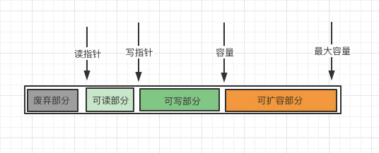
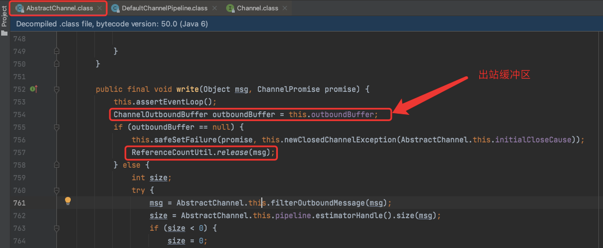
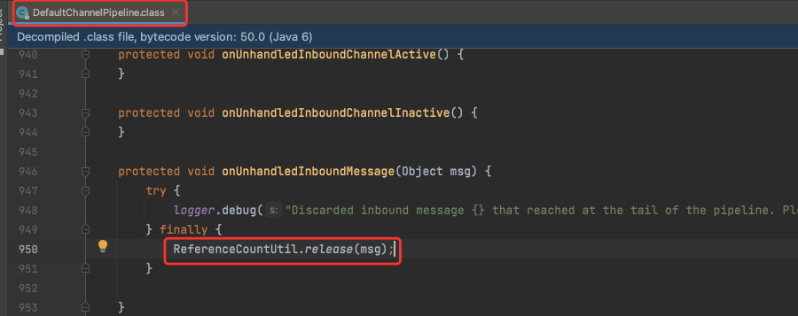
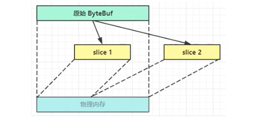
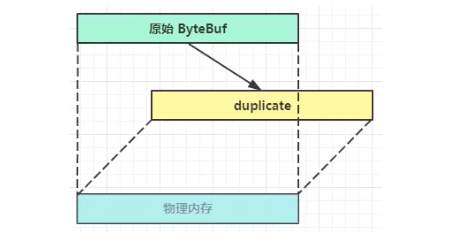

> `ByteBuf`是对字节数据的封装

## 一、创建

### 1.打印ByteBuf工具类

```java
import io.netty.buffer.ByteBuf;
import static io.netty.buffer.ByteBufUtil.appendPrettyHexDump;
import static io.netty.util.internal.StringUtil.NEWLINE;

public class ByteBufUtils {
    public static void log(ByteBuf buffer) {
        int length = buffer.readableBytes();
        int rows = length / 16 + (length % 15 == 0 ? 0 : 1) + 4;
        StringBuilder buf = new StringBuilder(rows * 80 * 2)
                .append("read index:").append(buffer.readerIndex())
                .append(" write index:").append(buffer.writerIndex())
                .append(" capacity:").append(buffer.capacity())
                .append(NEWLINE);
        appendPrettyHexDump(buf, buffer);
        System.out.println(buf.toString());
    }
}
```

### 2、创建

```java
import io.netty.buffer.ByteBuf;
import io.netty.buffer.ByteBufAllocator;

public class TestByteBuf {
    public static void main(String[] args) {
        ByteBuf buf = ByteBufAllocator.DEFAULT.buffer(10);
        ByteBufUtils.log(buf);
    }
}
```

上面代码创建了一个默认的ByteBuf(池化基于直接内存的Bytebuf)，初始化容量是10  
控制台输出：
```
read index:0 write index:0 capacity:10
```

## 二、直接内存 vs 堆内存

> * 直接内存创建和销毁的代价昂贵，但读写性能高(少一次内存复制)，适合配合池化功能一起用
> * 直接内存对GC压力小，因为这部分内存不受JVM垃圾回收的管理，但也要注意主动及时主动释放

创建池化基于堆内存的ByteBuf：
```java
ByteBuf buf = ByteBufAllocator.DEFAULT.heapBuffer(10);
```

创建池化基于内存的ByteBuf：
```java
ByteBuf buf = ByteBufAllocator.DEFAULT.directBuffer(10);
```

## 三、池化 vs 非池化
 
> * 4.1之前，池化功能还不成熟，默认是非池化实现
> * 4.1之后，非Android平台默认启用池化实现，Android平台启用非池化实现

池化的最大意义在于可以重用ByteBuf，有点有：
 * 没有池化，则每次都得创建新的ByteBuf实例，这个操作对直接内存代价昂贵，就算是堆内存，也会增加GC压力
 * 有了池化，则可以重用池中ByteBuf实例，并且采用了与jemalloc类似的内存分配算法提升分配效率
 * 高并发时，池化功能更节约内存，减少内存溢出的可能
 
池化功能是否开启，可以通过系统变量来设置
```
-Dio.netty.allocator.type={unpooled|pooled}
```

## 四、组成
> 最开始读写指针都在 0 位置



## 五、写入
方法列表，省略一些不重要的方法  

| **方法签名** | **含义** | **备注** |  
| :--- | :--- | :--- |
|writeBollean(boolean value) | 写入 boolean 值|用一字节01/00代表true/false|  
|writeByte(int value) | 写入 Byte 值||  
|writeShort(int value) | 写入 short 值||  
|writeInt(int value) | 写入 int 值|Big Endian，即0x250，写入后 00 00 02 50|  
|writeIntLE(int value) | 写入 int 值|Little Endian，即0x250，写入后 50 02 00 00|  
|writeLong(long value) | 写入 long 值||  
|writeChar(int value) | 写入 char 值||  
|writeFloat(float value) | 写入 float 值||  
|writeDouble(double value) | 写入 double 值||  
|writeBytes(ByteBuf src) | 写入 netty 的值ByteBuf||  
|writeBytes(Byte[] src) | 写入 byte[] ||  
|writeBytes(ByteBuffer src) | 写入 nio 的ByteBuffer ||  
|int writeCharSequence(CharSequence sequence,charset charset) | 写入字符串 ||  

> 注意 ⚠️ ：  
> * 这些方法未指明返回值的，其返回值都是ByteBuf，意味着可以链式调用  
> * 网络传输，默认习惯是 `Big Endian`
> * 还有一类方法是set开头的，也可以写入数据，但不会改变指针位置

## 六、扩容

 * 如果写入后数据大小未超过512，则选择下一个16的整数倍，例如：写入后大小为12，则扩容后capacity是16
 * 如果写入后数据大小超过512，则选择下一个 2^n,例如：写入后大小为513，则扩容后capacity是2^10=1024(2^9=512已经不够了)
 * 扩容不能超过`max_capacity`会报错

## 七、读取

readByte() : 读取一个字节  
markReaderIndex() :  标记mark
resetReaderIndex() : 重置到标记位置

> 注意 ⚠️ ：
> * 还有种方法是get开头的，这些方法不会改变 read index

## 八、retain & release

由于Netty中有堆外内存的ByteBuf实现，堆外内存最好是手动来释放，而不是等GC垃圾回收
 * `UnpooledHeapByteBuf`使用的是JVM内存，只需要等`GC`回收内存即可
 * `UnpooledDirctByteBuf`使用的是直接内存，需要`特殊的方法`来回收内存
 * `PooledByteBuf`和它的子类使用了池化机制，需要`更复杂的规则`来回收内存

> 回收内存的源码实现，关注下面方法的不同实现  
> protected abstract void deallocate()

Netty这里采用了引用计数法来控制回收内存，每个ByteBuf都实现了ReferenceCounted接口
 * 每个ByteBuf对象的初始计数为1
 * 调用release方法计数减一，如果计数为0，ByteBuf内存被回收
 * 调用retain方法计数加1，表示调用者没用完之前，其他handler即便调用了release也不会造成回收
 * 当计数为0时，底层内存会被回收，这是即便ByteBuf对象还在，其各方法均无法正常使用

虽然有`head`和`tail`**兜底**，不过基本规则是：**谁最后使用，谁负责release**

### 1、HeadContext

```
DefaultChannelPipeline.class 
-> final class HeadContext
-> write(ChannelHandlerContext ctx, Object msg, ChannelPromise promise)
-> interface Channel #void write(Object var1, ChannelPromise var2)
-> AbstractChannel.class #AbstractUnsafe.class #write(Object msg, ChannelPromise promise)
```





### 2、TailContext

```
DefaultChannelPipeline.class  
-> final class TailContext  
-> channelRead(ChannelHandlerContext ctx, Object msg)  
-> onUnhandledInboundMessage(ChannelHandlerContext ctx, Object msg)  
-> onUnhandledInboundMessage(Object msg)
```



## 九、零拷贝

### 1、slice
【零拷贝】的体现之一，对原始ByteBuf进行切片成多个ByteBuf，切片后的ByteBuf并没有发生内存复制，还
是使用原始的ByteBuf的内存，切片后的ByteBuf维护独立的 read、write指针  



例：
```java
import io.netty.buffer.ByteBuf;
import io.netty.buffer.ByteBufAllocator;

public class TestSlice {

    public static void main(String[] args) {
        ByteBuf buffer = ByteBufAllocator.DEFAULT.buffer(10);
        buffer.writeBytes("abcdefghij".getBytes());
        ByteBufUtils.log(buffer);
        //slice()  / slice(0,10) 
        ByteBuf slice = buffer.slice();
        ByteBufUtils.log(slice);

        System.out.println("==========替换buffer第一个字节=====");
        buffer.setByte(0, 'b');
        //修改buffer数据，slice也受影响
        ByteBufUtils.log(slice);

    }
}
```

日志输出：
```
read index:0 write index:10 capacity:10
         +-------------------------------------------------+
         |  0  1  2  3  4  5  6  7  8  9  a  b  c  d  e  f |
+--------+-------------------------------------------------+----------------+
|00000000| 61 62 63 64 65 66 67 68 69 6a                   |abcdefghij      |
+--------+-------------------------------------------------+----------------+
read index:0 write index:10 capacity:10
         +-------------------------------------------------+
         |  0  1  2  3  4  5  6  7  8  9  a  b  c  d  e  f |
+--------+-------------------------------------------------+----------------+
|00000000| 61 62 63 64 65 66 67 68 69 6a                   |abcdefghij      |
+--------+-------------------------------------------------+----------------+
==========替换buffer第一个字节=====
read index:0 write index:10 capacity:10
         +-------------------------------------------------+
         |  0  1  2  3  4  5  6  7  8  9  a  b  c  d  e  f |
+--------+-------------------------------------------------+----------------+
|00000000| 62 62 63 64 65 66 67 68 69 6a                   |bbcdefghij      |
+--------+-------------------------------------------------+----------------+
```

### 2、duplicate

【零拷贝】的体现之一，就好比截取了原始ByteBuf所有内容，并且没有max capacity的限制，也是ByteBuf
使用同一块底层内存，只是读写指针是独立的



### 3、copy

会将底层内存数据进行深拷贝，因此无论读写，都与原始ByteBuf无关

### 4、CompositeByteBuf
```java
package me.xyh.netty.c2;

import io.netty.buffer.ByteBuf;
import io.netty.buffer.ByteBufAllocator;
import io.netty.buffer.CompositeByteBuf;

public class TestComposite {

    public static void main(String[] args) {
        ByteBuf buf1 = ByteBufAllocator.DEFAULT.buffer();
        buf1.writeBytes("abcde".getBytes());

        ByteBuf buf2 = ByteBufAllocator.DEFAULT.buffer();
        buf2.writeBytes("abcde".getBytes());

        CompositeByteBuf buffer = ByteBufAllocator.DEFAULT.compositeBuffer();
        //需要设置为true 不然会导致读写指针不移动
        buffer.addComponents(true, buf1, buf2);
        ByteBufUtils.log(buffer);
    }
}

```

## 十、Unpooled工具类

> 提供了非池化的ByteBuf创建、组合、复制等操作。

### 1、wrappedBuffer

> 与【零拷贝】相关，可以用来包装ByteBuf

使用示例1：包装ByteBuf
```java
import io.netty.buffer.ByteBuf;
import io.netty.buffer.ByteBufAllocator;
import io.netty.buffer.ByteBufUtil;
import io.netty.buffer.Unpooled;

public class TestUnpooled {

    public static void main(String[] args) {
        ByteBuf buf1 = ByteBufAllocator.DEFAULT.buffer();
        buf1.writeBytes("abcde".getBytes());

        ByteBuf buf2 = ByteBufAllocator.DEFAULT.buffer();
        buf2.writeBytes("abcde".getBytes());

        //包装ByteBuf个数超过一个时，底层使用了CompositeByteBuf
        ByteBuf buf3 = Unpooled.wrappedBuffer(buf1, buf2);
        System.out.println(ByteBufUtil.prettyHexDump(buf3));
    }
}
```

使用示例2：包装普通字节数组
```java
import io.netty.buffer.ByteBuf;
import io.netty.buffer.ByteBufAllocator;
import io.netty.buffer.ByteBufUtil;
import io.netty.buffer.Unpooled;
public class TestUnpooled {
    public static void main(String[] args) {
        //包装普通字节数组，底层也不会有拷贝操作
        ByteBuf buf4 = Unpooled.wrappedBuffer(new byte[]{'a','b','c'},new byte[]{'d','e','f'});
        System.out.println(ByteBufUtil.prettyHexDump(buf4));
    }
}
```

##💡ByteBuf优势
 * 池化-可以重用池中ByteBuf实例，更节约内存，减少内存溢出的可能
 * 读写指针分离，不需要像ByteBuffer一样切换读写模式
 * 可以自动扩容
 * 支持链式调用，使用更流畅
 * 很多地方体现零拷贝，例如slice、duplicate、CompositeByteBuf


