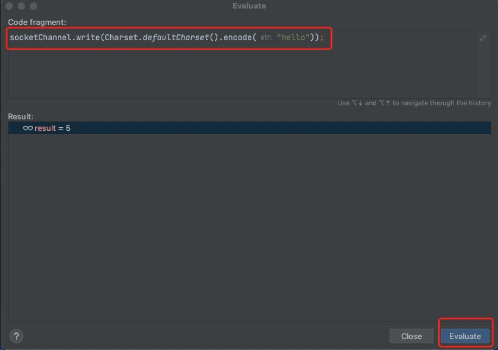

> 在没有数据可读时，包括数据复制过程中，线程必须阻塞等待，不会占用cpu，但线程相当于闲置  
> 32位jvm一个线程320k，64位jvm 一个线程1024k，为了减少线程数，需要采用线程池技术  
> 但即便使用了线程池，如果很多连接建立，长时间 inactive，会阻塞线程池中所有线程

## 一.代码示例
下面的代码，只是演示一下阻塞的效果  
`ServerSocketChannel.accept()` 和 `SocketChannel.read(buffer)` 两个方法，会阻塞线程的执行  
下面的执行效果就是如果有两个客户端连接后，会出现互相影响 连接和数据的读取操作

### 1.服务端(server)代码

```java
import lombok.extern.slf4j.Slf4j;
import me.xyh.netty.bytebuffer.ByteBufferUtil;

import java.io.IOException;
import java.net.InetSocketAddress;
import java.nio.ByteBuffer;
import java.nio.channels.ServerSocketChannel;
import java.nio.channels.SocketChannel;
import java.util.ArrayList;
import java.util.List;

@Slf4j
public class Server {
    public static void main(String[] args) throws IOException {
        //初始化一个 ByteBuffer
        ByteBuffer buffer = ByteBuffer.allocate(16);
        //创建服务器
        ServerSocketChannel serverSocketChannel = ServerSocketChannel.open();
        //监听8080 端口
        serverSocketChannel.bind(new InetSocketAddress(8080));
        //存放连接集合
        List<SocketChannel> socketChannelList = new ArrayList<>();
        while(true){
            // accept 建立与客户端连接
            //SocketChannel 用来和客户端之间通信
            log.info("等待连接...");
            SocketChannel socketChannel = serverSocketChannel.accept();
            log.info("等待成功...{}", socketChannel);
            socketChannelList.add(socketChannel);
            for (SocketChannel channel : socketChannelList) {
                // 接收客户端发送的数据
                log.info("等待接收数据...{}", socketChannel);
                channel.read(buffer);
                buffer.flip();
                ByteBufferUtil.debugRead(buffer);
                buffer.clear();
                log.info("接收数据完成...{}", socketChannel);
            }
        }
    }
}

```

### 2.客户端(client)代码
```java
import java.io.IOException;
import java.net.InetSocketAddress;
import java.nio.channels.SocketChannel;

public class Client {
    public static void main(String[] args) throws IOException {
        SocketChannel socketChannel = SocketChannel.open();
        socketChannel.connect(new InetSocketAddress("localhost",8080));
        System.out.println("等待。。。。");

    }
}

```

### 3.操作步骤
 * a. 启动服务端代码
 ```
 //服务端控制台输出：
 14:18:37 [INFO ] [main] m.x.n.nio.Server - 等待连接...
 ```
 * b.启动客户端代码，在`System.out.println("等待。。。。");` 打断点，使用debug模式启动
 ```
 //服务端控制台输出：
 14:18:37 [INFO ] [main] m.x.n.nio.Server - 等待连接...
 14:20:07 [INFO ] [main] m.x.n.nio.Server - 等待成功...java.nio.channels.SocketChannel[connected local=/127.0.0.1:8080 remote=/127.0.0.1:54296]
 14:20:07 [INFO ] [main] m.x.n.nio.Server - 等待接收数据...java.nio.channels.SocketChannel[connected local=/127.0.0.1:8080 remote=/127.0.0.1:54296]
 ```
 * c.在客户端中，使用 **Evaluate Expression..** 功能



```
 //服务端控制台输出：
 14:18:37 [INFO ] [main] m.x.n.nio.Server - 等待连接...
 14:20:07 [INFO ] [main] m.x.n.nio.Server - 等待成功...java.nio.channels.SocketChannel[connected local=/127.0.0.1:8080 remote=/127.0.0.1:54296]
 14:20:07 [INFO ] [main] m.x.n.nio.Server - 等待接收数据...java.nio.channels.SocketChannel[connected local=/127.0.0.1:8080 remote=/127.0.0.1:54296]
 +--------+-------------------- read -----------------------+----------------+
 position: [0], limit: [5]
 +-------------------------------------------------+
 |  0  1  2  3  4  5  6  7  8  9  a  b  c  d  e  f |
 +--------+-------------------------------------------------+----------------+
 |00000000| 68 65 6c 6c 6f                                  |hello           |
 +--------+-------------------------------------------------+----------------+
 14:24:57 [INFO ] [main] m.x.n.nio.Server - 接收数据完成...java.nio.channels.SocketChannel[connected local=/127.0.0.1:8080 remote=/127.0.0.1:54329]
 14:24:57 [INFO ] [main] m.x.n.nio.Server - 等待连接...
 ```
 * d.再次发送消息，服务端控制台无变化


```
 //服务端控制台输出：
 14:18:37 [INFO ] [main] m.x.n.nio.Server - 等待连接...
 14:20:07 [INFO ] [main] m.x.n.nio.Server - 等待成功...java.nio.channels.SocketChannel[connected local=/127.0.0.1:8080 remote=/127.0.0.1:54296]
 14:20:07 [INFO ] [main] m.x.n.nio.Server - 等待接收数据...java.nio.channels.SocketChannel[connected local=/127.0.0.1:8080 remote=/127.0.0.1:54296]
 +--------+-------------------- read -----------------------+----------------+
 position: [0], limit: [5]
 +-------------------------------------------------+
 |  0  1  2  3  4  5  6  7  8  9  a  b  c  d  e  f |
 +--------+-------------------------------------------------+----------------+
 |00000000| 68 65 6c 6c 6f                                  |hello           |
 +--------+-------------------------------------------------+----------------+
 14:24:57 [INFO ] [main] m.x.n.nio.Server - 接收数据完成...java.nio.channels.SocketChannel[connected local=/127.0.0.1:8080 remote=/127.0.0.1:54329]
 14:24:57 [INFO ] [main] m.x.n.nio.Server - 等待连接...
 ```
 * e.设置idea，可以开启多个client(视频里面是 Allow parallel run)
 


 * f.启动一个新的client,接收到了 "resend"的客户端发送内容
```
//服务端控制台输出新增
14:36:36 [INFO ] [main] m.x.n.nio.Server - 等待成功...java.nio.channels.SocketChannel[connected local=/127.0.0.1:8080 remote=/127.0.0.1:54407]
14:36:36 [INFO ] [main] m.x.n.nio.Server - 等待接收数据...java.nio.channels.SocketChannel[connected local=/127.0.0.1:8080 remote=/127.0.0.1:54407]
+--------+-------------------- read -----------------------+----------------+
position: [0], limit: [6]
         +-------------------------------------------------+
         |  0  1  2  3  4  5  6  7  8  9  a  b  c  d  e  f |
+--------+-------------------------------------------------+----------------+
|00000000| 72 65 73 65 6e 64                               |resend          |
+--------+-------------------------------------------------+----------------+
14:36:36 [INFO ] [main] m.x.n.nio.Server - 接收数据完成...java.nio.channels.SocketChannel[connected local=/127.0.0.1:8080 remote=/127.0.0.1:54407]
14:36:36 [INFO ] [main] m.x.n.nio.Server - 等待接收数据...java.nio.channels.SocketChannel[connected local=/127.0.0.1:8080 remote=/127.0.0.1:54407]
```
 * g.新的client发送一条数据


```
//服务端控制台输出新增
+--------+-------------------- read -----------------------+----------------+
position: [0], limit: [11]
         +-------------------------------------------------+
         |  0  1  2  3  4  5  6  7  8  9  a  b  c  d  e  f |
+--------+-------------------------------------------------+----------------+
|00000000| 6e 65 77 20 63 6f 6e 6e 65 63 74                |new connect     |
+--------+-------------------------------------------------+----------------+
14:37:03 [INFO ] [main] m.x.n.nio.Server - 接收数据完成...java.nio.channels.SocketChannel[connected local=/127.0.0.1:8080 remote=/127.0.0.1:54407]
14:37:03 [INFO ] [main] m.x.n.nio.Server - 等待连接...
```

> 这个场景符合的应该是一个线程一个 SocketChannel


