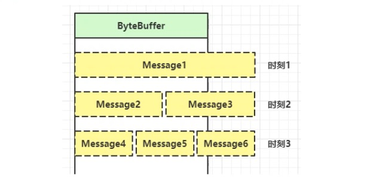
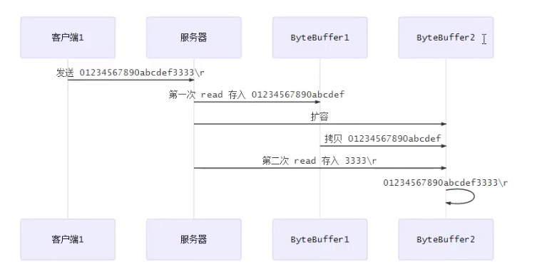

> 问题：客户端传输到服务器端的消息可能很长也可能很短

## 一.问题描述
因为ByteBuffer在定义的时候，是需要设置大小的。所以会出现下图的情况：


## 二.解决方案
 * 固定消息长度，数据包大小一样，服务器按预定长度读取，缺点是浪费带宽
 * 按分隔符拆分，缺点是效率低
 * TLV格式，即Type 类型、Length 长度、Value 数据，类型和长度已知的情况下，就可以方便获取消息大小，
   分配合适的buffer， 缺点是 buffer需要提前分配，如果内容过大，则影响server吞吐量
   - Http 1.1 是 TLV 格式
   - Http 2.0 是 LTV 格式

## 三.按分隔符(`\n`)拆分演示
> 需要注意的是，ByteBuffer是线程不安全的，所以需要每个channel维护一个独立的ByteBuffer



### 1.服务端代码

```java
import lombok.extern.slf4j.Slf4j;
import me.xyh.netty.bytebuffer.ByteBufferUtil;

import java.io.IOException;
import java.net.InetSocketAddress;
import java.nio.ByteBuffer;
import java.nio.channels.SelectionKey;
import java.nio.channels.Selector;
import java.nio.channels.ServerSocketChannel;
import java.nio.channels.SocketChannel;
import java.util.Iterator;

@Slf4j
public class SplitBufferServer {

    public static void main(String[] args) throws IOException {
        //初始化一个 Selector
        Selector selector = Selector.open();
        //初始化一个 ServerSocketChannel 并设置为 非阻塞模式
        ServerSocketChannel ssc = ServerSocketChannel.open();
        ssc.configureBlocking(false);
        //注册到 Selector
        SelectionKey sscKey = ssc.register(selector, 0, null);
        //设置监听 ACCEPT 事件
        sscKey.interestOps(SelectionKey.OP_ACCEPT);
        //绑定端口为 8080
        ssc.bind(new InetSocketAddress(8080));

        while (true){
            //阻塞，监听事件
            selector.select();
            //获取到所有发生的事件
            Iterator<SelectionKey> keys = selector.selectedKeys().iterator();
            while (keys.hasNext()){
                SelectionKey key = keys.next();
                //需要手动移除，否则会报错
                keys.remove();
                log.info("key: {}", key);
                //区分事件类型
                if(key.isAcceptable()){//accept事件
                    ServerSocketChannel channel = (ServerSocketChannel) key.channel();
                    SocketChannel sc = channel.accept();
                    //设置为非阻塞
                    sc.configureBlocking(false);
                    //修改一. 使用 attachment, 将buffer作为附件设置到 SelectionKey中
                    ByteBuffer buffer = ByteBuffer.allocate(16);
                    SelectionKey scKey = sc.register(selector, 0, buffer);
                    //监听读事件
                    scKey.interestOps(SelectionKey.OP_READ);
                    log.info("{}", sc);
                }else if(key.isReadable()){//read 事件
                    try{
                        SocketChannel channel = (SocketChannel)key.channel();
                        //获取附件
                        ByteBuffer buffer = (ByteBuffer) key.attachment();
                        int read = channel.read(buffer);
                        if(read == -1){
                            key.cancel();
                            continue;
                        }
                        //修改二. 如果没有读取过，表示内容过长，需要扩容
                        split(buffer);
                        if(buffer.position() == buffer.limit()){//没有读取过
                            //扩容
                            ByteBuffer newBuffer = ByteBuffer.allocate(buffer.capacity() * 2);
                            //拷贝到新buffer中
                            buffer.flip();
                            newBuffer.put(buffer);
                            //更新附件
                            key.attach(newBuffer);
                        }

                    }catch (IOException e){
                        key.cancel();
                    }
                }
            }
        }
    }

    private static void split(ByteBuffer source){
        //切换成读模式
        source.flip();
        //遍历 找到 \n
        for (int i = 0; i < source.limit(); i++) {
            if(source.get(i) == '\n'){//符合拆分条件
                //获取到符合条件的数据的长度
                int length = i + 1 - source.position();
                ByteBuffer target = ByteBuffer.allocate(length);
                for (int j = 0; j < length; j++) {
                    //放入到新的ByteBuffer中
                    target.put(source.get());
                }
                ByteBufferUtil.debugAll(target);
            }
        }
        //把剩余数据向前推
        //如果没有读取过数据，postion = limit
        source.compact();
    }
}
```

### 2.客户端代码

```java
import java.io.IOException;
import java.net.InetSocketAddress;
import java.nio.channels.SocketChannel;
import java.nio.charset.Charset;

public class SplitBufferClient {

    public static void main(String[] args) throws IOException {
        SocketChannel sc = SocketChannel.open();
        sc.connect(new InetSocketAddress("localhost",8080));
        sc.write(Charset.defaultCharset().encode("0123\n"));
        sc.write(Charset.defaultCharset().encode("0123456789abcdefg\n"));
        System.in.read();
    }
}

```

### 3.执行结果

```
14:11:03 [INFO ] [main] m.x.n.n.SplitBufferServer - key: sun.nio.ch.SelectionKeyImpl@27082746
14:11:03 [INFO ] [main] m.x.n.n.SplitBufferServer - java.nio.channels.SocketChannel[connected local=/127.0.0.1:8080 remote=/127.0.0.1:50168]
14:11:03 [INFO ] [main] m.x.n.n.SplitBufferServer - key: sun.nio.ch.SelectionKeyImpl@1ff8b8f
+--------+-------------------- all ------------------------+----------------+
position: [5], limit: [5]
         +-------------------------------------------------+
         |  0  1  2  3  4  5  6  7  8  9  a  b  c  d  e  f |
+--------+-------------------------------------------------+----------------+
|00000000| 30 31 32 33 0a                                  |0123.           |
+--------+-------------------------------------------------+----------------+
14:11:03 [INFO ] [main] m.x.n.n.SplitBufferServer - key: sun.nio.ch.SelectionKeyImpl@1ff8b8f
14:11:03 [INFO ] [main] m.x.n.n.SplitBufferServer - key: sun.nio.ch.SelectionKeyImpl@1ff8b8f
+--------+-------------------- all ------------------------+----------------+
position: [18], limit: [18]
         +-------------------------------------------------+
         |  0  1  2  3  4  5  6  7  8  9  a  b  c  d  e  f |
+--------+-------------------------------------------------+----------------+
|00000000| 30 31 32 33 34 35 36 37 38 39 61 62 63 64 65 66 |0123456789abcdef|
|00000010| 67 0a                                           |g.              |
+--------+-------------------------------------------------+----------------+

```
