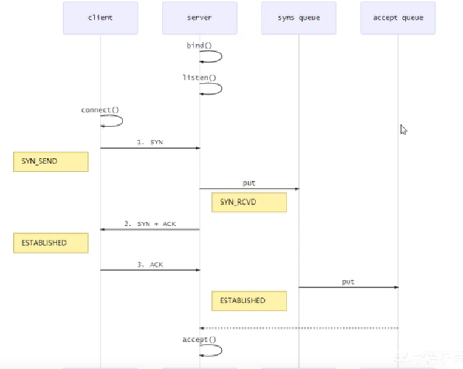
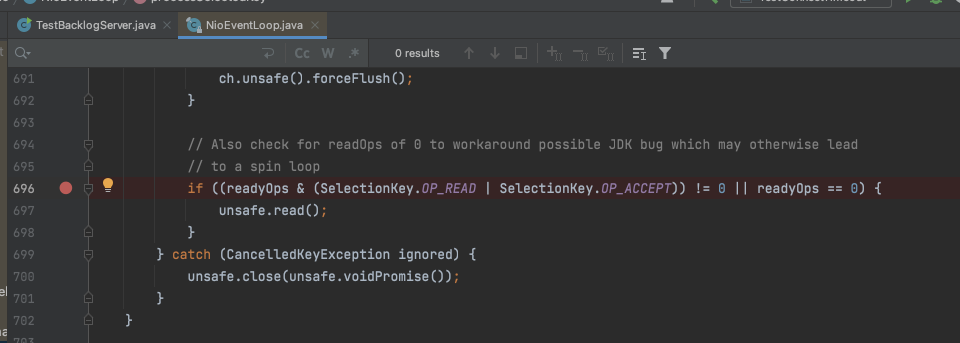

> 说明：  
> 客户端：  
>  * 通过`.option()`方法配置参数  
> 
> 服务端：
>  * 通过`new ServerBootstrap().option()`，是给`ServerSocketChannel`配置参数
>  * 通过`new ServerBootstrap().childOption()`，是给`SocketChannel`配置参数

## 一、CONNECT_TIMEOUT_MILLIS

### 1、说明

 * 属于`SocketChannel`参数
 * 用于客户端建立连接时，如果在指定毫秒内无法连接，会抛出 `timeout`异常
 * `SO_TIMEOUT`主要用在阻塞IO，阻塞IO中accept、read等都是无限等待的，如果不希望永远阻塞，使用它调整超时时间

### 2、客户端实现

```java
import io.netty.bootstrap.Bootstrap;
import io.netty.channel.ChannelFuture;
import io.netty.channel.ChannelOption;
import io.netty.channel.nio.NioEventLoopGroup;
import io.netty.channel.socket.nio.NioSocketChannel;
import io.netty.handler.logging.LoggingHandler;
import lombok.extern.slf4j.Slf4j;

@Slf4j
public class TestConnectTimeout {

    public static void main(String[] args) {
        NioEventLoopGroup group = new NioEventLoopGroup();
        try{
            Bootstrap bootstrap = new Bootstrap()
                    .group(group)
                    .option(ChannelOption.CONNECT_TIMEOUT_MILLIS, 300)
                    .channel(NioSocketChannel.class)
                    .handler(new LoggingHandler());
            //因为使用 localhost 一直模拟不出来，使用这个地址
            ChannelFuture channelFuture = bootstrap.connect("www.baidu.com", 8080);
            ChannelFuture future = channelFuture.sync();//断点
            future.channel().closeFuture().sync();
        }catch (Exception e){
            e.printStackTrace();
            log.debug("timeout");
        }finally {
            group.shutdownGracefully();
        }
    }
}
```

### 3、控制台输出
```
18:49:14 [DEBUG] [nioEventLoopGroup-2-1] i.n.h.l.LoggingHandler - [id: 0xc9d9418e] REGISTERED
18:49:14 [DEBUG] [nioEventLoopGroup-2-1] i.n.h.l.LoggingHandler - [id: 0xc9d9418e] CONNECT: www.baidu.com/180.101.49.11:8080
18:49:14 [DEBUG] [nioEventLoopGroup-2-1] i.n.h.l.LoggingHandler - [id: 0xc9d9418e] CLOSE
18:49:14 [DEBUG] [main] m.x.n.c.TestConnectTimeout - timeout
18:49:14 [DEBUG] [nioEventLoopGroup-2-1] i.n.h.l.LoggingHandler - [id: 0xc9d9418e] UNREGISTERED
io.netty.channel.ConnectTimeoutException: connection timed out: www.baidu.com/180.101.49.11:8080
	at io.netty.channel.nio.AbstractNioChannel$AbstractNioUnsafe$1.run(AbstractNioChannel.java:263)
	at io.netty.util.concurrent.PromiseTask$RunnableAdapter.call(PromiseTask.java:38)
	at io.netty.util.concurrent.ScheduledFutureTask.run(ScheduledFutureTask.java:127)
	at io.netty.util.concurrent.AbstractEventExecutor.safeExecute(AbstractEventExecutor.java:163)
	at io.netty.util.concurrent.SingleThreadEventExecutor.runAllTasks(SingleThreadEventExecutor.java:416)
	at io.netty.channel.nio.NioEventLoop.run(NioEventLoop.java:515)
	at io.netty.util.concurrent.SingleThreadEventExecutor$5.run(SingleThreadEventExecutor.java:918)
	at io.netty.util.internal.ThreadExecutorMap$2.run(ThreadExecutorMap.java:74)
	at io.netty.util.concurrent.FastThreadLocalRunnable.run(FastThreadLocalRunnable.java:30)
	at java.lang.Thread.run(Thread.java:748)
```

### 4、源码

> 通过`at io.netty.channel.nio.AbstractNioChannel$AbstractNioUnsafe$1.run(AbstractNioChannel.java:263)`点进去

```java
public abstract class AbstractNioChannel extends AbstractChannel {
    protected abstract class AbstractNioUnsafe extends AbstractUnsafe implements NioUnsafe {
        @Override
        public final void connect(
                final SocketAddress remoteAddress, final SocketAddress localAddress, final ChannelPromise promise) {
            //...
            // 获取超时时间
            int connectTimeoutMillis = config().getConnectTimeoutMillis();
            if (connectTimeoutMillis > 0) {
                //启动一个定时任务
                connectTimeoutFuture = eventLoop().schedule(new Runnable() {
                    @Override
                    public void run() {
                        ChannelPromise connectPromise = AbstractNioChannel.this.connectPromise;
                        //断点---thread模式
                        ConnectTimeoutException cause =
                                new ConnectTimeoutException("connection timed out: " + remoteAddress);
                        //把异常抛出
                        if (connectPromise != null && connectPromise.tryFailure(cause)) {
                            close(voidPromise());
                        }
                    }
                }, connectTimeoutMillis, TimeUnit.MILLISECONDS);
            }
            //...
        }
        //...
    }
}
```

## 二、SO_BACKLOG

> 属于`ServerSocketChannel`参数

### 1、TCP三次握手

> 1.第一次握手，*client*发送**SYN**到*server*，状态修改为`SYN_SEND`，*server*收到，状态改变为`SYN_REVD`，并
>   将该请求放入`sync queue`队列  
> 2.第二次握手，*server*回复**SYN+ACK**给*client*，*client*收到，状态改变为`ESTABLISHED`，并发送**ACK**给*server*  
> 3.第三次握手，*server*收到**ACK**，状态改变为`ESTABLISHED`，将该请求从`sync queue`放入`accept queue`中



其中：  
 * 在linux2.2之前，backlog大小包括了两个队列的大小，在2.2之后，分别用下面两个参数来控制
 * sync queue - 半连接队列
    * 大小通过 `/proc/sys/net/ipv4/tcp_max_syn_backlog`指定，在`syncookies`启用的情况下，逻辑上没有最大值限制，这个设置便被忽略
 * accept queue - 全连接队列
    * 大小通过 `/proc/sys/net/ipv4/somaxconn`指定，在使用listen函数时，内核会根据传入的backlog参数与系统参数，**取二者的较小值**
    * 如果accept queue队列满了，server将发送一个拒绝连接的错误到client

netty中：  
可以通过 option(ChannelOption.SO_BACKLOG,值)来设置大小

### 2、代码实现
```java
import io.netty.bootstrap.ServerBootstrap;
import io.netty.channel.ChannelInitializer;
import io.netty.channel.ChannelOption;
import io.netty.channel.nio.NioEventLoopGroup;
import io.netty.channel.socket.SocketChannel;
import io.netty.channel.socket.nio.NioServerSocketChannel;
import io.netty.handler.logging.LoggingHandler;

public class TestBacklogServer {
    public static void main(String[] args) {
        new ServerBootstrap()
                .group(new NioEventLoopGroup())
                .option(ChannelOption.SO_BACKLOG, 2)
                .channel(NioServerSocketChannel.class)
                .childHandler(new ChannelInitializer<SocketChannel>() {
                    @Override
                    protected void initChannel(SocketChannel ch) throws Exception {
                        ch.pipeline().addLast(new LoggingHandler());
                    }
                }).bind(8080);
    }
}

```

### 3、测试方法

在下图位置打断点，并调整成Thread模式


## 三、ulimit -n

 * 属于操作系统参数，_启动脚本修改_
 * 限制一个进程能够同时打开的最大的`文件描述符(FD)`的数量

## 四、TCP_NODELAY

 * 属于SocketChannel参数
 * nagle算法：一次尽可能多的发送数据，小数据包一起发送，会出现延迟
 * netty中默认`false(开启nagle算法)`,最好设置为 true

## 五、SO_SNDBUF & SO_RCVBUF

 * 发送缓冲区、接收缓冲区 (最好不设置，因为现在的操作系统会自己计算)
 * SO_SNDBUF属于SocketChannel参数
 * SO_RCVBUF既可以用于SocketChannel参数，可以用于ServerSocketChannel参数(建议设置到ServerSocketChannel上)


