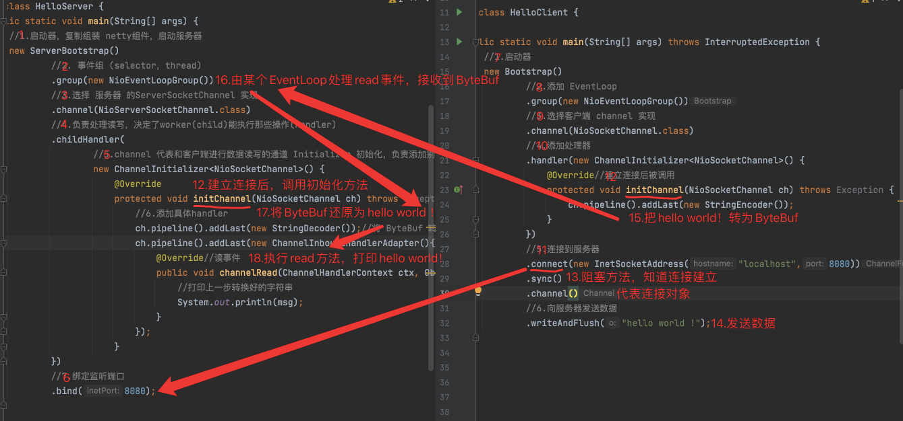

## 一.简介

`Netty` 是一个异步的(调用时的异步)、基于事件驱动(多路复用)的网络应用框架，
用于快速开发可维护、高性能的网络服务器和客户端

## 二.Hello World！入门程序

### 1.HelloServer

```java
import io.netty.bootstrap.ServerBootstrap;
import io.netty.channel.ChannelHandlerContext;
import io.netty.channel.ChannelInboundHandlerAdapter;
import io.netty.channel.ChannelInitializer;
import io.netty.channel.nio.NioEventLoopGroup;
import io.netty.channel.socket.nio.NioServerSocketChannel;
import io.netty.channel.socket.nio.NioSocketChannel;
import io.netty.handler.codec.string.StringDecoder;

public class HelloServer {
    public static void main(String[] args) {
        //1.启动器，复制组装 netty组件，启动服务器
        new ServerBootstrap()
                //2. 事件组 (selector，thread)
                .group(new NioEventLoopGroup())
                //3.选择 服务器 的ServerSocketChannel 实现
                .channel(NioServerSocketChannel.class)
                //4.负责处理读写，决定了worker(child)能执行那些操作(Handler)
                .childHandler(
                        //5.channel 代表和客户端进行数据读写的通道 Initializer 初始化，负责添加别的 Handler
                        new ChannelInitializer<NioSocketChannel>() {
                            @Override
                            protected void initChannel(NioSocketChannel ch) throws Exception {
                                //6.添加具体handler
                                ch.pipeline().addLast(new StringDecoder());//将 ByteBuf 转换为字符串
                                ch.pipeline().addLast(new ChannelInboundHandlerAdapter(){//自定一handler
                                    @Override//读事件
                                    public void channelRead(ChannelHandlerContext ctx, Object msg) throws Exception {
                                        //打印上一步转换好的字符串
                                        System.out.println(msg);
                                    }
                                });
                            }
                })
                //7.绑定监听端口
                .bind(8080);
    }
}

```

### 2.HelloClient

```java
import io.netty.bootstrap.Bootstrap;
import io.netty.channel.ChannelInitializer;
import io.netty.channel.nio.NioEventLoopGroup;
import io.netty.channel.socket.nio.NioSocketChannel;
import io.netty.handler.codec.string.StringEncoder;

import java.net.InetSocketAddress;

public class HelloClient {

    public static void main(String[] args) throws InterruptedException {
        //1.启动器
        new Bootstrap()
                //2.添加 EventLoop
                .group(new NioEventLoopGroup())
                //3.选择客户端 channel 实现
                .channel(NioSocketChannel.class)
                //4.添加处理器
                .handler(new ChannelInitializer<NioSocketChannel>() {
                    @Override//建立连接后被调用
                    protected void initChannel(NioSocketChannel ch) throws Exception {
                        ch.pipeline().addLast(new StringEncoder());
                    }
                })
                //5.连接到服务器
                .connect(new InetSocketAddress("localhost",8080))
                .sync()
                .channel()
                //6.向服务器发送数据
                .writeAndFlush("hello world !");
    }
}

```

### 3.控制台输出

 * 先启动 HelloServer
 * 然后启动 HelloClient
```
hello world !
```

### 4.执行流程图解



### 5.理解
* 把`channel` 理解为数据的通道
* 把`msg`理解为流动的数据，最开始输入是ByteBuf，但经过 pipeline(流水线)的加工，会变成其他对象类型，最后
  输出又变成ByteBuf
* 把`Handler` 理解为数据的处理工序
   * 工序又多道，合在一起就是 pipeline，pipeline负责发布事件（读、读取完成...）传播给每个handler，handler
     会对自己感兴趣的事件进行处理（重写了相应事件处理方法）
   * handler分为 inbound 和 outbound 两类
* 把`eventLoop`理解为处理数据的工人
   * 工人可以管理多个channel的 io 操作，并且一旦工人负责了某个channel，就要负责到底（绑定）
   * 工人即可以执行 io 操作，也可以进行任务处理，每位工人又任务队列，队列里可以堆放多个channel的待处理任务
     任务分为普通任务、定时任务
   * 工人按照 pipeline 顺序，依次按照 handler 的规划（代码）处理数据，可以为没到工序指定不同的工人