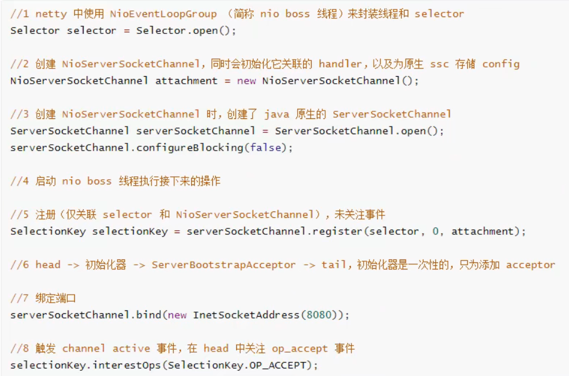
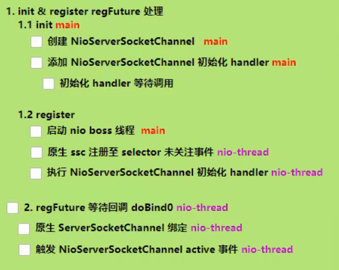

> 之后都是对于源码的一些阅读吧，如果把视频中一步步是怎么阅读的其实没有必要，因为这种阅读源码更重要的是方法吧。
> 这里就零散的记录一些后面的内容吧！

----

### 1、启动流程

**最主要是看看netty是怎么实现NIO的流程的吧！**

首先在NIO中启动流程如下图：

> 主要是做下面四件事情：  
> ServerSocketChannel ssc = ServerSocketChannel.open()  
> SelectionKey selectionKey = ssc.register(selector, 0, nettySsc)  
> ssc.bind(new InetSocketAddress(8080, backlog))  
> selectionKey.interestOps(SelectionKey.OP_ACCEPT)  

在Netty中的实现--从bind(port)方法进入，可以看到下面的这个源码流程

### 2、NioEventLoop的重要组成

 * Selector(selector/unwrappedSelector)、线程(thread)、任务队列(scheduledTaskQueue)
 * NioEventLoop即会处理IO事件，也会处理普通任务和定时任务

### 3、selector何时创建

构造方法调用时创建