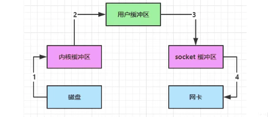

## 一.stream vs channel
* stream 不会自动缓冲数据，channel会利用系统提供的发送缓冲区、接收缓冲区(更为底层)
* stream 仅支持阻塞 API，channel 同时支持阻塞、非阻塞 API，网络channel 可以配合selector实现多路复用
* 两者均为全双工，即读写可以同时进行

## 二.IO模型

当调用一次channel.read 或 stream.read 后，会切换至操作系统内核态来完成真正的数据读写，而读取又分为两个阶段，分别为：
* 等待数据阶段
* 复制数据阶段


### 1.阻塞IO


### 2.非阻塞IO

> 用户程序空间会多次调用，请求是否有数据
> 只是在等待数据阶段是非阻塞的，在复制数据阶段还是阻塞的


### 3.多路复用

> 先select 等待事件发生，可能会有很多事件
> 然后在一个个按顺序执行事件


### 4.异步IO

* 同步：线程自己去获取结果（一个线程）
* 异步：线程自己不去获取结果，而是由其他线程送结果（至少两个线程）


## 三.零拷贝


 > 整个过程仅只发生了一次用户态与内核态的切换，数据拷贝了2次，所谓的【零拷贝】，并不是真正的无拷贝，而是不会拷贝重复数据到 
 > JVM内存中。 

零拷贝优点：
 * 更少的用户态与内核态的切换
 * 不利用CPU计算，减少CPU缓存伪共享
 * 零拷贝适合小文件传输

### 1.传统方式
传统的IO将一个文件通过socket写出
```
File f = new File("../data.txt");
RandomAccessFile file = new RandomAccessFile(file,"r");

byte[] buf = new byte[(int)f.length()];
file.read(buf);

Socket socket = ...;
socket.getOutPutStream().write(buf);
```

内部工作流程是这样的：


1. java本身并不具备IO读写能力，因此read方法调用后，要从java程序的*用户态*切换至*内核态*，去调用操作
  系统(Kernel)的读能力，将数据读入*内核缓冲区*。这期间用户线程阻塞，操作系统使用DMA(Direct 
  Memory Access)来实现文件读，期间也不会使用CPU
  >DMA也可以理解为硬件单元，用来解放CPU完成文件IO

2. 从*内核态*切换回用户态，将数据从*内核缓冲区*读入*用户缓冲区*(即byte[] buf),这期间CPU会参与拷贝，
无法利用DMA
3. 调用write方法，这时将数据从*用户缓冲区*(即byte[] buf)写入*socket缓冲区*，CPU会参与拷贝
4. 接下来要向网卡写数据，这项能力java又不具备，因此又得从用户态切换至内核态，调用操作系统的写能
力，使用DMA将*socket缓冲区*的数据写入网卡，不会使用CPU

可以看到中间环节较多，java的IO实际不是物理设备级别的读写，而是缓存的复制，底层的真正读写是操作系统
来完成的
 * 用户态与内核态的切换发生了3次，这个操作比较重量级
 * 数据拷贝了共4次

### 2.NIO优化
通过DirectByteBuffer
 * ByteBuffer.allocate(10) HeapByteBuffer **使用的还是java内存**
 * ByteBuffer.allocateDirect(10) DirectByteBuffer **使用的是操作系统内存**


java可以使用`DirectByteBuffer`将堆外内存映射到JVM内存中来直接访问使用
 * 这块内存不受JVM垃圾回收的影响，因此内存地址固定，有助于IO读写
 * java中的`DirectByteBuffer`对象仅维护了此内存的虚地址，内存回收分两步
   * `DirectByteBuffer`对象垃圾回收，将虚引用加入引用队列
   * 通过专门线程访问引用队列，根据虚引用释放堆外内存
 * __减少了一次数据拷贝__，用户态与内核态的切换次数没有减少

### 3.linux2.1优化
> 底层采用了linux2.1后提供的sendFile方法，java中对应着两个channel调用transferTo/transferFrom方法拷贝数据


1. java调用transferTo方法后，要从java程序的*用户态*切换至*内核态*，使用DMA将数据读入*内核缓冲区*，不会使用CPU
2. 数据从*内核缓冲区*传输到*socket缓冲区*，CPU会参与
3. 最后使用DMA将*socket缓冲区*的数据写入网卡，不会使用CPU

 * 只发生了一次用户态与内核态的切换
 * 数据拷贝了三次

### 4.linux2.4优化


1. java调用transferTo方法后，要从java程序的*用户态*切换至*内核态*，使用DMA将数据读入*内核缓冲区*，不会使用CPU
2. 只会将一些offset 和length 信息拷入 *socket缓冲区*， 几乎无消耗
3. 最后使用DMA将*内核缓冲区*的数据写入网卡，不会使用CPU


