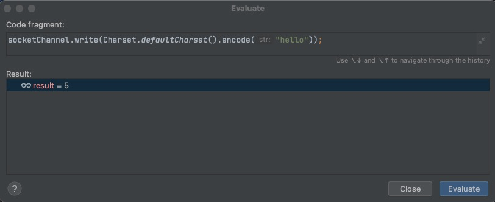

> 通过设置 ServerSocketChannel.configureBlocking(false) 使 accept 方法变成非阻塞  
> 通过设置 SocketChannel.configureBlocking(false) 使 read(buffer) 方法变成非阻塞  

 * 非阻塞模式下，相关方法都会让线程不暂停
   - 在ServerSocketChannel.accept 在没有连接建立时，会返回 null，继续运行
   - SocketChannel.read 在没有数据可读时，会返回 0 ，但线程不必阻塞，可以去执行其他SocketChannel
     的read或者是去执行 ServerSocketChannel.accept
   - 写数据时，线程只是等待数据写入Channel即可，无需等Channel通过网络把数据发送出去
 * 非阻塞模式下，即使没有连接建立，和可读数据，线程仍然在不断运行，白白浪费CPU
 * 数据复制过程中，线程实际还是阻塞的(AIO 改进的地方)


## 一.代码示例
在非阻塞模式下：  
 * ServerSocketChannel.accept() 如果没有客户端发起连接 返回null  
 * SocketChannel.read(buffer) 如果没有接收到数据 返回 0

### 1.服务端(server)代码

```java
import lombok.extern.slf4j.Slf4j;
import me.xyh.netty.bytebuffer.ByteBufferUtil;

import java.io.IOException;
import java.net.InetSocketAddress;
import java.nio.ByteBuffer;
import java.nio.channels.ServerSocketChannel;
import java.nio.channels.SocketChannel;
import java.util.ArrayList;
import java.util.List;

@Slf4j
public class UnBlockServer {
    public static void main(String[] args) throws IOException, InterruptedException {
        //初始化一个 ByteBuffer
        ByteBuffer buffer = ByteBuffer.allocate(16);
        //创建服务器
        ServerSocketChannel serverSocketChannel = ServerSocketChannel.open();
        //监听8080 端口
        serverSocketChannel.bind(new InetSocketAddress(8080));
        //设置为非阻塞模式
        serverSocketChannel.configureBlocking(false);
        //存放连接集合
        List<SocketChannel> socketChannelList = new ArrayList<>();
        while(true){
            // accept 建立与客户端连接
            //SocketChannel 用来和客户端之间通信
            SocketChannel socketChannel = serverSocketChannel.accept();
            log.info("等待连接...");
            if(socketChannel != null){
                log.info("连接成功...{}", socketChannel);
                //设置为非阻塞模式
                socketChannel.configureBlocking(false);
                socketChannelList.add(socketChannel);
            }
            for (SocketChannel channel : socketChannelList) {
                // 接收客户端发送的数据
                int read = channel.read(buffer);
                log.info("等待接收数据...");
                if(read > 0){
                    buffer.flip();
                    ByteBufferUtil.debugRead(buffer);
                    buffer.clear();
                    log.info("接收数据完成...{}", channel);
                }
            }
            //sleep 2秒
            Thread.sleep(2000);
        }
    }
}


```

### 2.客户端(client)代码
```java
import java.io.IOException;
import java.net.InetSocketAddress;
import java.nio.channels.SocketChannel;

public class Client {
    public static void main(String[] args) throws IOException {
        SocketChannel socketChannel = SocketChannel.open();
        socketChannel.connect(new InetSocketAddress("localhost",8080));
        System.out.println("等待。。。。");

    }
}

```

### 二.调试
* 1. 启动服务端代码 会一直循环调用，输出等待连接...日志
 ```
 //服务端控制台输出：
15:23:27 [INFO ] [main] m.x.n.n.UnBlockServer - 等待连接...
15:23:29 [INFO ] [main] m.x.n.n.UnBlockServer - 等待连接...
15:23:31 [INFO ] [main] m.x.n.n.UnBlockServer - 等待连接...
15:23:33 [INFO ] [main] m.x.n.n.UnBlockServer - 等待连接...
.
.
.
 ```
* 2.启动客户端代码，在`System.out.println("等待。。。。");` 打断点，使用debug模式启动
 ```
 //服务端控制台输出：
 15:23:33 [INFO ] [main] m.x.n.n.UnBlockServer - 等待连接...
 15:23:33 [INFO ] [main] m.x.n.n.UnBlockServer - 连接成功...java.nio.channels.SocketChannel[connected local=/127.0.0.1:8080 remote=/127.0.0.1:54796]
 15:23:33 [INFO ] [main] m.x.n.n.UnBlockServer - 等待接收数据...
 15:23:35 [INFO ] [main] m.x.n.n.UnBlockServer - 等待连接...
 15:23:35 [INFO ] [main] m.x.n.n.UnBlockServer - 等待接收数据...
 15:23:37 [INFO ] [main] m.x.n.n.UnBlockServer - 等待连接... 
 ```
* 3.在客户端中，使用 **Evaluate Expression..** 功能



```
//服务端控制台输出：
15:23:49 [INFO ] [main] m.x.n.n.UnBlockServer - 等待连接...
15:23:49 [INFO ] [main] m.x.n.n.UnBlockServer - 等待接收数据...
+--------+-------------------- read -----------------------+----------------+
position: [0], limit: [5]
         +-------------------------------------------------+
         |  0  1  2  3  4  5  6  7  8  9  a  b  c  d  e  f |
+--------+-------------------------------------------------+----------------+
|00000000| 68 65 6c 6c 6f                                  |hello           |
+--------+-------------------------------------------------+----------------+
15:23:49 [INFO ] [main] m.x.n.n.UnBlockServer - 接收数据完成...java.nio.channels.SocketChannel[connected local=/127.0.0.1:8080 remote=/127.0.0.1:54796]
15:23:51 [INFO ] [main] m.x.n.n.UnBlockServer - 等待连接...
15:23:51 [INFO ] [main] m.x.n.n.UnBlockServer - 等待接收数据...
 ```

> 非阻塞模式可以让单线程也能处理多个 socket  
> 不过这个线程会比较繁忙，一直处于运行的状态，轮训一样


