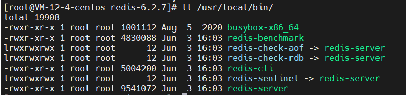

## 一、认识NoSQL

|  | **SQL(关系型数据库)** | **NoSQL(非关系型数据库)** |  
| :---: | :---: | :---: |  
| **数据类型** | 结构化(Structured) | 非结构化 |  
| **数据关联** | 关联的(Relational) | 无关联的 |  
| **查询方式** | SQL查询(语法格式统一) | 非SQL |  
| **事务特性** | ACID | BASE |  
| **存储方式** | 磁盘 | 内存 |  
| **扩展性** | 垂直 | 水平 |  
| **使用场景** | 1.数据结构固定<br/>2.相关业务对数据安全性、一致性要求较高 | 1.数据结构不固定<br/>2.对一致性、安全性要求不高<br/>3.对性能要求 |  

> NoSql: 键值类型(Redis)、文档类型(MongoDB)、列类型(HBase)、Graph类型(Neo4j)

## 二、认识Redis

Redis诞生于2009年，全称是Remote Dictionary Server，远程词典服务器，是一个基于内存的键值NoSQL数据库。  

**特征:**
 * 键值(key-value)型,value支持多种不同数据结构，功能丰富
 * 单线程，每个`命令`具备原子性 (_网络部分是多线程的_)
 * 低延迟，速度快(基于内存、IO多路复用、良好的编码)
 * 支持数据持久化
 * 支持主从集群、分片集群
 * 支持多语言客户端
 
## 三、安装Redis

> 基于linux服务器部署项目(CentOS7)  
> 官网地址 https://redis.io/

### 1、安装Redis依赖

Redis是基于`C语言`编写的，因此首先需要安装Redis所需要的`gcc依赖`：

> yum install -y gcc tcl

### 2、上传安装包并解压

上传位置可以是任意目录，例如: `/usr/local/src`


解压到当前目录
```shell
tar -zxvf redis-6.2.7.tar.gz
```


进入redis目录

```shell
cd redis-6.2.7/
```

运行编译命令

```shell
make && make install
```

默认安装路径 `/usr/local/bin/`,执行下面命令，如截图即安装成功

```shell
ll /usr/local/bin/
```



 * redis-cli:是redis提供的命令行客户端
 * redis-server:是redis的服务端启动脚本
 * redis-sentinel:是redis的哨兵启动脚本

### 3、启动

redis的启动方式有很多种：
 * 默认启动
 * 指定配置启动
 * 开机启动

#### 3.1、默认启动(不推荐)

```shell
#进入安装目录
cd /usr/local/src/redis-6.2.7

# 启动
redis-server
```


这种启动属于`前台启动`，会阻塞整个会话窗口，窗口关闭或者按下`CTRL+C`则Redis停止。

#### 3.2、指定配置启动

如果要让Redis以`后台`方式启动，则必须修改Redis配置文件，就在我们之前解压的redis安装包下(`/usr/local/src/redis-6.2.7`),
名字叫`redis.conf`


> 可以使用命令备份一份，也可以下载到本地一份
> `cp redis.conf redis.conf.bck`

**配置说明：**

```shell
# 监听的地址，默认127.0.0.1，会导致只能本地访问。修改为0.0.0.0则可以在任意IP访问，生产环境不要设置为0.0.0.0
bing 0.0.0.0
# 守护进程，修改为yes后即可后台运行
daemonize yes
# 密码，设置后访问redis必须输入密码
requirepass 123456

##-----其他配置介绍

# 监听的端口
port 6379

# 工作目录，默认是当前目录，也就是运行redis-server时的命令、日志、持久化等文件会保存在这个目录
dir .

# 数据库数量，设置为1，代表只使用一个库，默认是16，编号0-15
databases 1

# 设置redis能够使用的最大内存
maxmemory 512mb

# 日志文件，默认为空，不记录日志，可以指定日志文件名
logfile "redis.log"
```

启动Redis:
```shell
#进入安装目录
cd /usr/local/src/redis-6.2.7

# 启动
redis-server redis.conf
```

停止Redis
```shell
# 第一种 直接杀进程
ps -ef|grep redis
kill -9 进程号

# 第二种 利用redis-cli来执行 `shutdown` 命令，即停止Redis服务
# 因为之前配置了密码，因此需要通过 -a 来指定密码
redis-cli -a 123456 shutdown
```

#### 3.3、开机启动

首先，新建一个系统服务文件

```shell
vi /etc/systemd/system/redis.service
```

内容如下：
```shell
[Unit]
Description=redis-server
After=network.target

[Service]
Type=forking
ExecStart=/usr/local/bin/redis-server /usr/local/src/redis-6.2.7/redis.conf

[Install]
WantedBy=multi-user.target
```

执行下面命令，使配置生效：

```shell
# 
systemctl daemon-reload
# Redis开机自启
systemctl enable redis

##------------其他命令
#启动
systemctl start redis
#停止
systemctl stop redis
#重启
systemctl restart redis
#查看状态
systemctl status redis
```

### 4、Redis客户端

 * 命令行客户端
 * 图形化桌面客户端
 * 编程客户端

#### 4.1、命令行客户端

Redis安装完成后就自带了命令行客户端：redis-cli

```shell
redis-cli [options] [commonds]
```

其中常见的options有：
 * `-h 127.0.0.1` : 指定要连接的redis节点的IP地址，默认127.0.0.1
 * `-p 6379` : 指定要连接的redis节点的端口，默认6379
 * `-a 123456` : 指定redis访问密码

其中commonds就是redis的操作命令，例如：
 * `ping` : 与redis服务端做心跳测试，服务端正常会返回 `pong`  

不指定commonds时，会进入`redis-cli`的交互控制台

#### 4.1、图形化桌面客户端

> 免费的小老板：https://github.com/lework/RedisDesktopManager-Windows/releases

