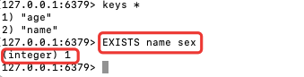

## 一、Redis数据结构介绍
Redis是一个key-value的数据库，key一般是String类型，不过value的类型多种多样
基本类型：String、Hash、List、Set、SortedSet
特殊类型：GEO、BitMap、HyperLog

> 💡 在Redis中查看命令的两种方式：  
> 1、[官网](https://redis.io/commands) ： (可以根据group分组查询)  
> 2、命令行界面 ：`help命令/help @分组  `
> 💡 获取具体用法也是两种  
> 1、[官网](https://redis.io/commands) ：直接点击具体命令查看--比较详细  
> 2、命令行界面：`help [command]  `

----

## 二、Redis通用命令(常见)

> 💡 查看方式：  
>  1、[官网](https://redis.io/commands)：group选择`generic`
>  2、命令行：`help @generic`

### 1、KEYS
 
 * 查看符合模版的所有key
 * **不建议在生产环境中使用**，数据量大的情况下，执行效率低，会阻塞redis其他命令的执行


用例：查询a开头的所有key  


### 2、DEL

 * 删除一个指定的key
 * 可以同时指定**多个key**
 * 即使指定的key值不存在，也**不会报错**
 * 返回值代表**实际**删除key的**个数**


用例：删除多个  


### 3、EXISTS

 * 判断key是否存在
 * 可以同时指定**多个key**
 * 返回值代表**实际**存在的**个数**

用例：判断多个key是否存在



### 4、EXPIRE & TTL

 * EXPIRE:给一个key设置有效期，有效期到期时该key会被自动删除
 * TTL:查看一个key的剩余有效期
    * 返回`-1`表示永久有效
    * 返回`-2`表示已经被移除/不存在

用例：添加一个指定事件的key-value，用TTL查看这个key的剩余有效期


----

## 三、String类型

> String类型，也就是字符串类型，是Redis中最简单的存储类型。  
> 其value值是字符串，不过根据字符串的格式不同，又可以分为3类：  
>    * String: 普通字符串  
>    * int: 整数类型，可以做自增、自减操作  
>    * float: 浮点类型，可以做自增、自减操作  
> 不管是哪种格式，底层都是字节数组形式存储，只不过是编码方式不同。字符串类型的最大空间不能操作512m

### 1、SET & GET & SET & MGET
 * SET：**添加**或者**修改已经存在**的一个String类型键值对
 * GET：根据key获取String类型的value
 * MSET：批量添加多个String类型的键值对
 * MGET：根据多个key获取多个String类型的value


### 2、INCR & INCRBY

 * INCR：让一个整型的key自增1
 * INCRBY：让一个整型的key自增指定步长，例如` INCRBY num 2 `让num自增2


### 3、INCRBYFLOAT

 * INCRBYFLOAT:让一个浮点类型的数字自增并指定步长


### 4、SETNX

SETNX:添加一个String类型的键值对，前提是这个key不存在，否则不执行

> 使用效果与`SET key value NX`一致


### 5、SETEX

SETEX:添加一个String类型的键值对，并且指定有效期

> 使用效果与`SET key value EX second`一致


----
> 💡 Redis中没有类似MySQL中的Table概念，应该如何区分不同类型的key？  
> 例如：需要存储用户、商品信息到redis中，有一个用户id是1，有一个商品id恰好也是1  
> 因此： Redis的key允许有多个单词形成层级结构，多个单词之间用"`:`"隔开，格式如下：  
>    `项目名:业务名:类型:id`

----

## 四、Hash类型

> Hash类型，也较散列，其value是一个无序字典，类似Java中的HashMap结构。
> Hash结构可以将对象中的每个字段独立存储，可以针对单个字段做CRUD：


### 1、HSET
 
 * 添加或者修改hash类型key的field值

```shell
#HSET KEY FIELD VALUE
HSET Test:Student:1 name lilei
```

### 2、HGET

 * 获取一个hash类型key的field的值

```shell
# HGET KEY FIELD
HGET Test:Student:1 name
```

### 3、HMSET

 * 批量添加多个hash类型key的field的值
 * 使用`help HMSET`查看，命令格式和HSET一致，只是描述不一样

### 4、HMGET

 * 批量获取多个hash类型key中的field

```shell
#HMGET key field...
HMGET Test:Student:1 name age
```

### 5、HGETALL

 * 获取一个hash类型的key中的所有field和value

```shell
#HGETALL key
HGETALL Test:Student:1
```

### 6、HKEYS

 * 获取一个hash类型的key中的所有field

```shell
#HKEYS key
HKEYS Test:Student:1
```

### 7、HVALS

 * 获取一个hash类型的key中的所有value

```shell
#HVALS key
HVALS Test:Student:1
```

### 8、HINCRBY

 * 让一个hash类型key的字段值自增并指定步长

```shell
#HINCRBY key field increment
HINCRBY Test:Student:1 age 12
```

### 9、HSETNX

 * 添加一个hash类型的key的field值，前提是这个field不存在，否则不执行

```shell
#HSETNX key field value
HSETNX Test:Student:1 sex man
```

----

## 五、List类型

> Redis中的List类型和Java中的LinkedList类似，可以看做是一个双向链表结构。既可以支持正向检索，也可以支持反向检索  
> 特征也与LinkedList类似(常用来存储一个有序数据，例如：朋友圈点赞列表，评论列表等)：  
> * 有序
> * 元素可以重复
> * 插入和删除快
> * 查询速度一般

### 1、LPUSH & LPOP

 * LPUSH ：向列表左侧插入一个元素或者多个元素
 * LPOP ：移除并返回列表左侧第一个元素，没有则返回nil

```shell
# 向左推入 3个元素
127.0.0.1:6379> LPUSH users 1 2 3
# 返回队列元素个数
(integer) 3
# 取左侧第一个
127.0.0.1:6379> LPOP users
# 返回第一个元素3 (队列：先进后出 FILO)
"3"
```

### 2、RPUSH & RPOP

 * RPUSH ：向列表右侧插入一个元素或者多个元素
 * RPOP ：移除并返回列表右侧第一个元素，没有则返回nil

```shell
# 向右推入 3个元素
127.0.0.1:6379> RPUSH users 4 5 6
# 返回队列元素个数
(integer) 5
# 取右侧第一个
127.0.0.1:6379> RPOP users
# 返回第一个元素6 (队列：先进后出 FILO)
"6"
```

### 3、LRANGE

 * LRANGE ：返回一段角标范围内的所有元素

```shell
# 获取 下标 0 到 3 的元素
127.0.0.1:6379> LRANGE users 0 3
# 共 4 个， 从左到右
1) "2"
2) "1"
3) "4"
4) "5"
```

### 4、BLPOP & BRPOP

 * 与LPOP和RPOP类似，只不过没有元素时等待指定事件，而不是直接返回nil

```shell
# 控制台1 ：输入等待100秒的user2数据
127.0.0.1:6379> BLPOP user2 100
# 等待到的数据输出
1) "user2"
2) "2"
# 等待时间
(35.20s)

# 控制台2 ：从左插入两个数据
127.0.0.1:6379> LPUSH user2 1 2
(integer) 2
```

----


## 六、Set类型

> Redis中的Set类型和Java中的HashSet类似，可以看做是一个value为null的HashMap。   
> 因为也是一个hash表，因此具备HashSet类似的特征：(常用来存储一个有序数据，例如：朋友圈点赞列表，评论列表等)：
> * 无序
> * 元素不可重复
> * 查找快
> * 支持交集、并集、差集等功能

### 1、SADD & SREM & SCARD

 * SADD ： 向set中添加一个或多个元素
 * SREM ： 移除set中的指定元素
 * SCARD ： 返回set中元素个数
 
```shell
# 插入三个元素
127.0.0.1:6379> SADD person zhangsan lisi wangwu
# 返回成功插入个数
(integer) 3
# 获取当前存在元素个数
127.0.0.1:6379> SCARD person
# 返回当前元素个数
(integer) 3
# 移除一个元素
127.0.0.1:6379> SREM person zhangsan
# 移除元素成功个数
(integer) 1
# 获取当前存在元素个数
127.0.0.1:6379> SCARD person
# 返回当前元素个数
(integer) 2
```

### 2、SISMEMBER

 * SISMEMBER 判断一个元素是否存在于set中

```shell
127.0.0.1:6379> SISMEMBER person zhaoliu
(integer) 0
127.0.0.1:6379> SISMEMBER person lisi
(integer) 1
```

### 3、SMEMBERS

 * SMEMBERS: 获取set中所有元素

```shell
127.0.0.1:6379> SMEMBERS person
1) "lisi"
2) "zhangsan"
3) "wangwu"
```

### 4、SINTER & SDIFF & SUNION

 * SINTER ：求集合的交集
 * SDIFF key1 key2： 求集合的差集(key1中key2不存在的数据)
 * SUNION ： 求集合的并集

> set命令练习：  
> 将下列数据用Redis的set集合来存储：
> * 张三的好友有： 李四、王五、赵六 : `SADD zhangsan lisi wangwu zhaoliu`
> * 李四的好友有： 王五、麻子、二狗 : `SADD lisi wangwu mazi ergou`
> 利用Set的命令实现下列功能：
> * 计算张三的好友有几个人 : `SMEMBERS zhangsan`
> * 计算张三和李四有哪些共同好友 : `SINTER zhangsan lisi`
> * 计算哪些人是张三的好友却不是李四的好友 : `SDIFF zhangsan lisi`
> * 查询张三和李四的好友共有哪些人 : `SUNION zhangsan lisi`
> * 判断李四是否是张三的好友 : `SISMEMBER zhangsan lisi`
> * 判断张三是否是李四的好友 : `SISMEMBER lisi zhangsan`
> * 将李四从张三的好友列表中移除 : `SREM zhangsan lisi`

----

## 七、SortedSet类型

> Redis的SortedSet是一个可排序的set集合，与Java中的TreeSet有些类似，但底层数据机构却差别很大。SortedSet中的
> 每一个元素都带有一个score属性，可以基于score属性对元素排序，底层的实现是一个跳表(SkipList)加hash表。  
> SortedSet具备下列特性：(经常用来实现排行榜)  
> * 可排序
> * 元素不重复
> * 查询速度快

常见命令：  
 * ZADD key score member：添加一个或多个元素到sorted set，如果已经存在则更新其score值
 * ZREM key member：删除sorted set中的一个指定元素
 * ZSCORE key number：获取sorted set中的指定元素的score值
 * ZRANK key member：获取sorted set中的指定元素的排名
 * ZCARD key：获取sorted set中元素个数
 * ZCOUNT key min max：按照score值在给定范围内的所有元素的个数
 * ZINCRBY key increment member： 让sorted set中的指定元素自增，步长为指定的increment值
 * ZRANGE key min max：按照score排序后，获取指定排名范围内的元素
 * ZRANGEBYSCORE key min max：按照score排序后，获取指定score范围内的元素
 * ZDIFF、ZINTTER、ZUNION：求差集、交集、并集  
 ⚠️ 注意：所有的排名默认都是升序，如果要降序则在命令的Z后面添加REV即可

> SortedSet命令练习：  
> 将班级的下列同学得分存入Redis的SortedSet中：  
> stu jack 85 lucy 89 rose 82 tom 95 jerry 78 amy 92 miles 76 `ZADD stu 85 jack 89 lucy 82 rose 95 tom 78 jerry 92 amy 76 miles
`
> 并实现下列功能：
> * 删除tom同学 : `ZREM stu tom`
> * 获取amy同学的分数 : `ZSCORE stu amy`
> * 获取rose同学的排名 : `ZREVRANk stu rose`
> * 查询80分一下有几个学生 : `ZCOUNT stu 0 80`
> * 给amy同学加2分 : `ZINCRBY stu 2 amy`
> * 查出成绩前3名的同学 : `ZREVRANGE stu 0 2`
> * 查出成绩80分以下的所有同学 : `ZRANGEBYSCORE stu 0 80`
----