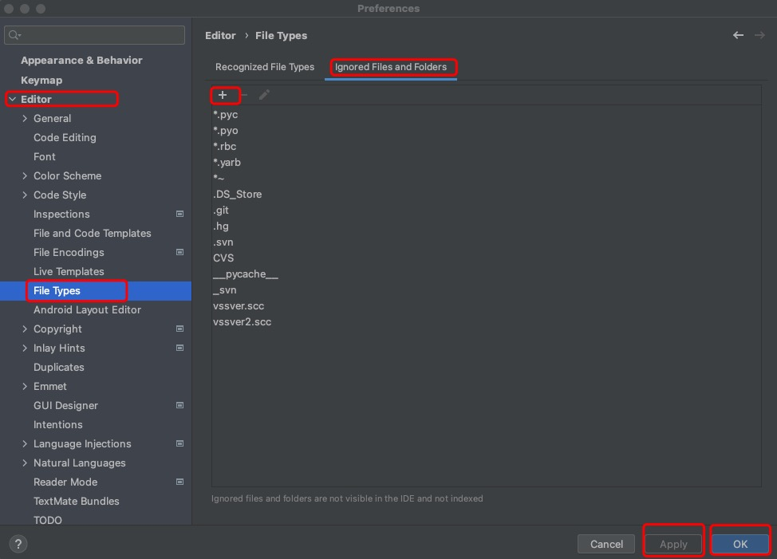
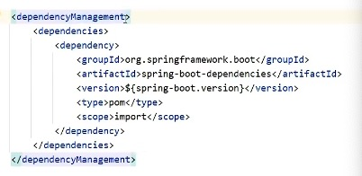

## 一、SpringBoot入门程序 <!-- {docsify-ignore-all} -->

### 1.SpringBoot设计目的
  用来*简化*Spring应用的*初始搭建*以及*开发过程*

### 2.国内通过idea创建项目可以使用阿里云版
> 地址： https://start.aliyun.com

### 3.idea中隐藏指定文件或者文件类型
```
 Setting【mac中为Preferences】 -> File Types -> Ignored Files and Folders 
 输入要隐藏的文件名，支持*号通配符
 回车确认添加
```



## 二、入门程序解析

### 1.parent
```
 1. 开发SpringBoot程序要继承 spring-boot-starter-parent
 2. spring-boot-starter-parent中定义了若干个依赖管理
 3. 继承parent模块可以 避免 多个依赖使用相同技术时出现 依赖 版本 冲突
 4. 继承parent的形式也可以采用引入依赖的形式实现效果
```


### 2.starter
```
SpringBoot中常见的项目名称，定义了当前项目使用的所有依赖坐标，以达到 减少依赖配置 的目的
```

### 3.引导类
启动方式：
```java
//启动这个引导类后，会初始化Spring容器，扫描这个类所在包加载bean
@SpringBootApplication
public class SpringBootApplication{
    //执行的这个main方法就可以启动程序
    public static void main(String[] args){
        SpringApplication.run(SpringBootApplication.class, args);
    }
}

```

### 4.辅助功能
```
1. 内嵌tomcat服务器是SpringBoot辅助功能之一
2. 内嵌tomcat工作原理是将tomcat服务器作为对象运行，并将该对象交给Spring容器管理
3. 变更内嵌服务器思想是去除现有服务器，添加全新的服务器
```

切换tomcat为jetty的方式
```xml
<dependency>
    <groupId>org.springframework.boot</groupId>
    <artifactId>spring-boot-starter-web</artifactId>
    <!--排除掉tomcat-->
    <exclusions>
        <exclusion>
            <groupId>org.springframework.boot</groupId>
            <artifactId>spring-boot-starter-tomcat</artifactId>
        </exclusion>
    </exclusions>
</dependency>
<!--添加jetty起步依赖， 版本由SpringBoot的starter控制-->
<dependency>
    <groupId>org.springframework.boot</groupId>
    <artifactId>spring-boot-starter-jetty</artifactId>
</dependency>


```


  