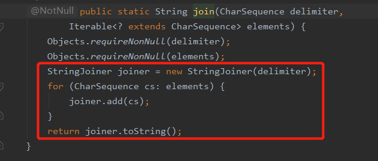

> 使用逗号拼接字符串
## 1.普通
```java
public class SplicingTest {

    public static void main(String[] args) {
        List<String> valueList = new ArrayList<>();
        Collections.addAll(valueList, "zhangsan", "lisi", "wangwu");
        // 逗号拼接
        StringBuilder sb = new StringBuilder("");
        for (String value : valueList) {
            sb.append("," + value);
        }
        String result = sb.toString();
        //截取掉 第一个逗号
        System.out.println(result.substring(1));
    }
}

// 控制台输出结果:
// zhangsan,lisi,wangwu
```

## 2.StringJoiner

StringJoiner是Java8新出的一个类，用于构造由分隔符分隔的字符序列，并可选择性地从提供的前缀开始和以提供的后缀结尾。

```java

public class SplicingTest {

    public static void main(String[] args) {
        List<String> valueList = new ArrayList<>();
        Collections.addAll(valueList, "zhangsan", "lisi", "wangwu");
        // 初始化拼接的 符号
        StringJoiner sb = new StringJoiner(",");
        for (String value : valueList) {
            sb.add(value);
        }
        String result = sb.toString();
        System.out.println(result);
    }
}
// 控制台输出结果:
// zhangsan,lisi,wangwu
```

## 3.String.join(delimiter,elements)

```java
public class SplicingTest {

    public static void main(String[] args) {
        List<String> valueList = new ArrayList<>();
        Collections.addAll(valueList, "zhangsan", "lisi", "wangwu");
        String result = String.join(",", valueList);
        System.out.println(result);
    }
}
// 控制台输出结果:
// zhangsan,lisi,wangwu

```

这种方式其实是对`StringJoiner`的一次封装




