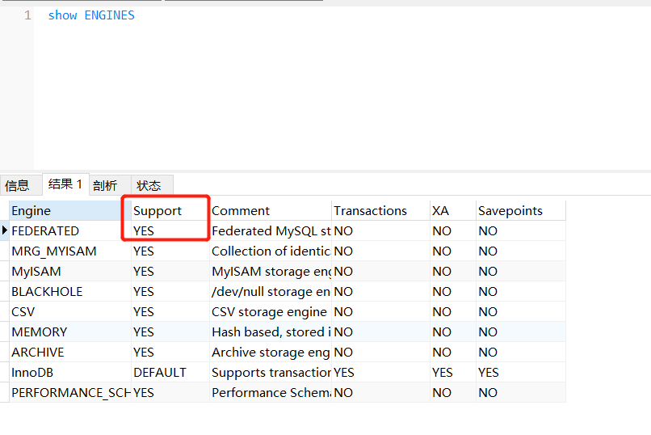
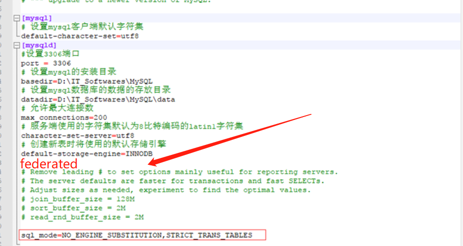

### 判断是否可以使用 FEDERATED 引擎



如上图为yes表示可以使用

如果support为No表示已经有 **FEDERATED** 引擎但是没有开启

1.window 中my.ini 默认在 C:\ProgramData\MySQL\MySQL Server 5.7 中

2.加入federated （需要是小写的，不然会重启失败）



3.重启 mysql服务


### 创建链接表

```
CREATE TABLE `v_jh_examctplan_link（可以 关联到的表名 + _link）` (
  `id` varchar(100) NOT NULL,
  `hospCode` varchar(50) DEFAULT NULL COMMENT '组织机构代码',
  `columnCode` varchar(100) DEFAULT NULL,
  `columnValue` varchar(1000) DEFAULT NULL,
  `update_date` timestamp NULL DEFAULT CURRENT_TIMESTAMP ON UPDATE CURRENT_TIMESTAMP,
  PRIMARY KEY (`id`)
) ENGINE=FEDERATED（引擎） DEFAULT CHARSET=utf8 
CONNECTION='mysql://数据库账号:数据库密码@ip:3306/库名/关联到的表名';
```

### 测试

```
#如果可以查询出 关联到的表  中的数据，表示ok
select * from v_jh_examctplan_link
```

