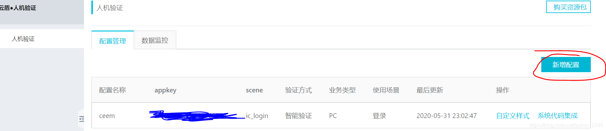

> 最近对接了一下阿里云验证码的智能验证，记录一下对接经过吧

## 1.对接工具类
```java

public class AliyunAfsUtil {
    private static final Logger logger = Logger.getLogger(AliyunAfsUtil.class);

    private static IClientProfile profile;

    private static IClientProfile initProfile() throws ClientException {
        // Create a new IClientProfile instance
        //IClientProfile可以复用，建议将其设置成应用程序全局唯一。
        if (null == profile) {
            synchronized (AliyunAfsUtil.class) {
                if (null == profile) {
                    profile = DefaultProfile.getProfile("cn-hangzhou", "accessKeyId", "secret");
                }
            }
        }
        return profile;
    }

    /**
     * 验签
     * @param param
     * @return
     */
    public static boolean isValid(Map<String,String> param) {
        try {
            IAcsClient client = new DefaultAcsClient(initProfile());
            DefaultProfile.addEndpoint("cn-hangzhou", "cn-hangzhou", "afs", "afs.aliyuncs.com");

            AuthenticateSigRequest request = new AuthenticateSigRequest();
            request.setSessionId(param.get("sessionId"));// 会话ID。必填参数，从前端获取，不可更改。
            request.setSig(param.get("sign"));// 签名串。必填参数，从前端获取，不可更改。
            request.setToken(param.get("token"));// 请求唯一标识。必填参数，从前端获取，不可更改。
            // 需要和前端传值一致
            request.setScene("scene");// 场景标识。必填参数。
            request.setAppKey("AppKey");// 应用类型标识。必填参数。
            //客户端IP。必填参数,  可以前端传 也可以后端自己获取
            request.setRemoteIp("ip");
            logger.info("阿里云验签-request:"+ JSON.toJSONString(request));
            //response的code枚举：100验签通过，900验签失败
            AuthenticateSigResponse response = client.getAcsResponse(request);
            logger.info("阿里云验签-response:"+ JSON.toJSONString(response));

            if(response!=null && response.getCode().equals(100)){
                return true;
            }
        } catch (ClientException ce) {
            logger.error("初始化IClientProfile异常",ce);
        } catch (Exception e) {
            logger.error("阿里云验签异常",e);
        }
        return false;
    }
}

```

## 2.报错 appkey cross validate!
这个报错的意思也挺简单，可以知道是自己appkey传值不对   
然后去控制台拿了一下appkey ，还是报错    
后面再去看了一下前端的对接代码，然后发现和前端的appkey传的值不一样    

后面解决是，在控制台，看了一下前后端对接的代码，然后才修复    
结论: **前后端传的 scene 和 AppKey 需要一致，其实可以统一从前端获取**

## 3.appkey 获取位置

