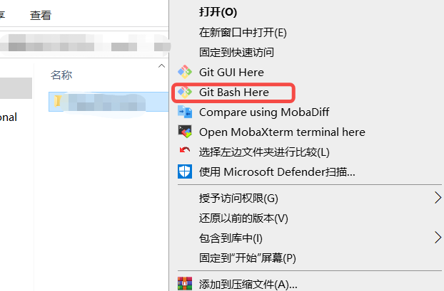

> 使用 MapStruct 做对象转换的时候，build的时候会自动生成实现类。
> 然后使用git提交的时候没有检查提交的问题，导致实现类也提交上去了。
> 回退操作后，本地的 `/target/generated-sources` 一直都是显示为修改的颜色。
> 在 `.gitignore`文件中加入这个路径，还是一直显示为修改的颜色

## 一.原因

缓存 gitignore只能忽略那些原来没有被track的文件，如果某些文件已经被纳入了版本管理中，则修改.gitignore是无效的.

## 二.解决方案(win)

### 1.选择项目文件,右键


### 2.执行以下命令
> 注意 ：有点
```bash
git rm -r --cached .
git add .
git commit -m 'update .gitignore'
```

> 实际使用以后感觉不是很靠谱。。。
> 会重新整个项目提交，合并到主分支的时候，提交记录会很大。过不了review

