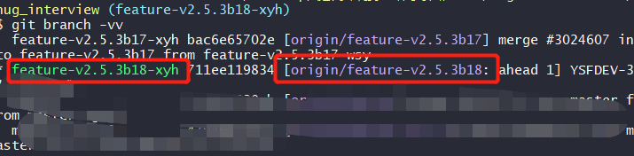
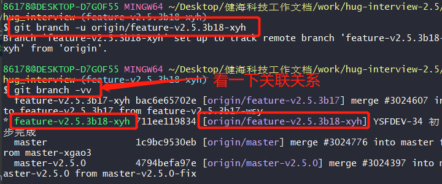

# IDEA新建分支后，切换远程分支关联

---

### 1.选择项目文件,右键


进入后会直接默认是idea中当前的分支

### 2.查看本地分支和远程分支的关联
```bash
git branch -vv
```


### 3.两种方式切换关联
```bash
git branch -u origin/分支名

git branch --set-upstream-to origin/分支名

# 解除分支
git branch --unset-upstream
```




