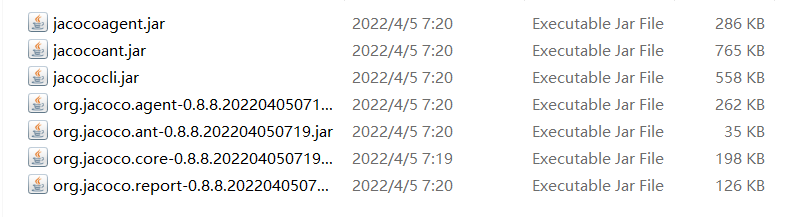

Jacoco 代码覆盖率

## 一、在[Jacoco的官网](https://www.jacoco.org/jacoco/index.html)下载了最新版本



## 二、项目启动的时候带上参数

- includes：包含com开头的类名
  
- classdumpdir：类文件存储的目录
  
- output：tcpserver方式，通过address和端口获取数据
  
- append：true是执行数据文件已经存在，则覆盖数据将附加到现有文件
  
  ### 1、自带容器的启动方式(jar)
  
  ```shell
  java -javaagent:jacocoagent.jar=includes=com.*,classdumpdir=classes,output=tcpserver,port=6300,address=localhost,append=true -jar jacoco_test.jar
  ```
  
  ### 2、使用tomcat的方式(war)
  
  把上面的参数放在启动参数里面
  

## 三、生成报告

> 下面为了整齐，都换行了不好直接复制

### 1、dump一个exec文件

```shell
# --address 服务的ip   
#--port 服务端口 
#--destfile 生成exec文件路径
java -jar jacococli.jar dump 
--address localhost 
--port 6300 
--destfile C:\Users\86178\jacoco\springboot_jacoco_test\exce\jacoco3.exec
```

### 2、合并多个exec文件

```shell
# 合并exec的文件
# --destfile 合并后的exec文件
java -jar jacococli.jar merge 
C:\Users\86178\jacoco\springboot_jacoco_test\exce\*.exec 
--destfile C:\Users\86178\jacoco\springboot_jacoco_test\exce\jacocoall.exec
```

### 3、根据exec文件生成report

```shell
# exec 地址
# --classfiles  编译后class文件地址
# --sourcefiles  实际代码地址
# --html 报告生成地址
java -jar jacococli.jar report
C:\Users\86178\jacoco\springboot_jacoco_test\exce\jacoco.exec
--classfiles C:\Users\86178\jacoco\jacoco_test\target\classes
--sourcefiles C:\Users\86178\jacoco\jacoco_test\src\main\java
--html C:\Users\86178\jacoco\springboot_jacoco_test\report
```

## 四、拓展：增量报告

实现方式：

1、通过JGit获取变更信息--方法级

2、重写jacoco相关代码 [有具体实现代码](https://gitee.com/Dray)

修改后生成报告方式

```shell
# 比上面多了一个参数 --diffCodeFiles 通过jgit生成的变更信息json串
java -jar jacococli.jar report 
C:\Users\86178\jacoco\springboot_jacoco_test\exce\jacocoall.exec 
--classfiles C:\Users\86178\jacoco\jacoco_test\target\classes 
--sourcefiles C:\Users\86178\jacoco\jacoco_test\src\main\java 
--html C:\Users\86178\jacoco\springboot_jacoco_test\report 
--diffCodeFiles C:\Users\86178\jacoco\springboot_jacoco_test\json\change.json
```

## 五、参考：

[腾讯jacoco原理](https://mp.weixin.qq.com/s?__biz=MzIxNzEyMzIzOA==&mid=2652314564&idx=1&sn=a93e6154c92acaef9204b8440e66a852&scene=21#wechat_redirect)

[增量覆盖率](https://gitee.com/Dray) 两个项目，一个jacoco，一个JGit

[用JGit通过Java来操作Git | 懒程序员改变世界](http://qinghua.github.io/jgit/)